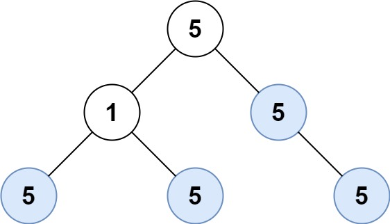

## YouTube Video

## Problem

Given the root of a binary tree, return the number of uni-value subtrees.

A uni-value subtree means all nodes of the subtree have the same value.

Example 1:


```
Input: root = [5,1,5,5,5,null,5]
Output: 4
```

Example 2:

```
Input: root = []
Output: 0
```

Example 3:

```
Input: root = [5,5,5,5,5,null,5]
Output: 6
```

## Code

```java
/**
 * Definition for a binary tree node.
 * public class TreeNode {
 *     int val;
 *     TreeNode left;
 *     TreeNode right;
 *     TreeNode() {}
 *     TreeNode(int val) { this.val = val; }
 *     TreeNode(int val, TreeNode left, TreeNode right) {
 *         this.val = val;
 *         this.left = left;
 *         this.right = right;
 *     }
 * }
 */
class Solution {
    int res = 0;
    public int countUnivalSubtrees(TreeNode root) {
        helper(root);
        return res;
    }

    private Boolean helper(TreeNode root) {
        if(root == null) return true;

        Boolean left = helper(root.left);
        Boolean right = helper(root.right);

        if(left && right) {
            if(root.left != null && root.left.val != root.val) {
                return false;
            }

            if(root.right != null && root.right.val != root.val) {
                return false;
            }

            res += 1;

            return true;
        }

        return false;
    }
}
```

```python
class Solution:
    # 要有一个返回值来确定子树是不是都是一个值的
    def helper(self, root: TreeNode) -> bool:
        if not root:
            return True

        left = self.helper(root.left)
        right = self.helper(root.right)

        if left and right:
            if (not root.left or root.left and root.left.val == root.val) \
            and (not root.right or root.right and root.right.val == root.val):
                self.res += 1
                return True

        return False

    def countUnivalSubtrees(self, root: TreeNode) -> int:
        self.res = 0
        self.helper(root)

        return self.res
```
