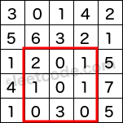

## YouTube Video

## Problem

Given a 2D matrix matrix, find the sum of the elements inside the rectangle defined by its upper left corner (row1, col1) and lower right corner (row2, col2).



The above rectangle (with the red border) is defined by (row1, col1) = (2, 1) and (row2, col2) = (4, 3), which contains sum = 8.

Example:

```
Given matrix = [
[3, 0, 1, 4, 2],
[5, 6, 3, 2, 1],
[1, 2, 0, 1, 5],
[4, 1, 0, 1, 7],
[1, 0, 3, 0, 5]
]

sumRegion(2, 1, 4, 3) -> 8
sumRegion(1, 1, 2, 2) -> 11
sumRegion(1, 2, 2, 4) -> 12
```

## Code

```java
class NumMatrix {
    int[][] dp;
    public NumMatrix(int[][] matrix) {
        if(matrix == null || matrix.length == 0 || matrix[0] == null || matrix[0].length == 0) return;

        int m = matrix.length;
        int n = matrix[0].length;

        dp = new int[m + 1][n + 1];

        for (int i = 0; i < m; i++){
            for(int j = 0; j < n; j++) {
                dp[i + 1][j + 1] = dp[i][j + 1] + dp[i + 1][j] + matrix[i][j] - dp[i][j];
            }
        }

    }

    public int sumRegion(int row1, int col1, int row2, int col2) {
        return dp[row2 + 1][col2 + 1] - dp[row1][col2 + 1] - dp[row2 + 1][col1] + dp[row1][col1];
    }
}

/**
 * Your NumMatrix object will be instantiated and called as such:
 * NumMatrix obj = new NumMatrix(matrix);
 * int param_1 = obj.sumRegion(row1,col1,row2,col2);
 */
```
