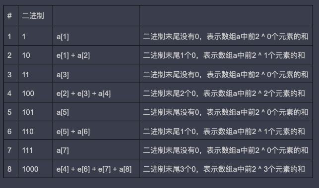

## YouTube Video

## Problem

Given an integer array nums, find the sum of the elements between indices i and j (i ≤ j), inclusive.

The update(i, val) function modifies nums by updating the element at index i to val.

Example:

```
Given nums = [1, 3, 5]

sumRange(0, 2) -> 9
update(1, 2)
sumRange(0, 2) -> 8
```

## Code

binary index tree 解法
解决问题 - 求前 N 项和 （The sum of the first n terms）

传统方法的复杂度

1. 求前 n 项和：O(N)
2. 更新数组：O(1)
3. 再求和：O(N)
   复杂度：如果上边的操作进行 m 次的话，O(M \* N)

使用 binary index tree 的复杂度

1. 求前 n 项和：O(log(N))
2. 更新数组：O(log(N))
3. 再求和：O(log(N))
   复杂度，操作 m 次：O(M \* log(N))




> i & -i 求最右边的 1 在哪儿，并返回那个数字
> 例如 1100 -> 100

```java
class NumArray {
    // index tree initialization
    class IndexTree{
        int[] sums;
        public IndexTree(int n){
            sums = new int[n + 1];
        }

        public void update(int i, int delta){
            while(i < sums.length){
                sums[i] += delta;
                // 每次给末尾的1再加1
                i += i & -i;
            }
        }

        public int query(int i){
            int sum = 0;
            while(i > 0){
                sum += sums[i];
                // 每次去掉最后一位的1, 找到对应的sums
                i -= i & -i;
            }
            return sum;
        }
    }

    // code
    IndexTree tree;
    int[] nums_;
    public NumArray(int[] nums) {
        nums_ = nums;
        tree = new IndexTree(nums.length);

        for(int i = 0; i < nums.length; i++){
            tree.update(i + 1, nums[i]);
        }
    }

    public void update(int i, int val) {
        tree.update(i + 1, val - nums_[i]);
        nums_[i] = val;
    }

    public int sumRange(int i, int j) {
        return tree.query(j + 1) - tree.query(i);
    }
}

/**
 * Your NumArray object will be instantiated and called as such:
 * NumArray obj = new NumArray(nums);
 * obj.update(i,val);
 * int param_2 = obj.sumRange(i,j);
 */
```
