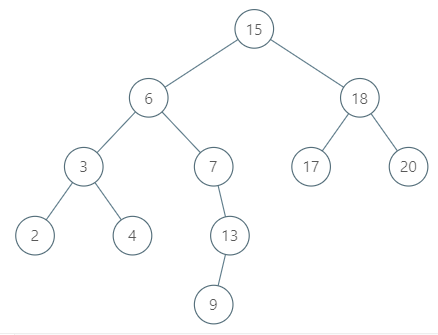

## Problem

Given a node in a binary search tree, return the in-order successor of that node in the BST. If that node has no in-order successor, return null.

The successor of a node is the node with the smallest key greater than node.val.

You will have direct access to the node but not to the root of the tree. Each node will have a reference to its parent node. Below is the definition for Node:

class Node {
public int val;
public Node left;
public Node right;
public Node parent;
}

Example 1:


```
Input: tree = [2,1,3], node = 1
Output: 2
Explanation: 1's in-order successor node is 2. Note that both the node and the return value is of Node type.
```

Example 2:


```
Input: tree = [5,3,6,2,4,null,null,1], node = 6
Output: null
Explanation: There is no in-order successor of the current node, so the answer is null.
```

Example 3:


```
Input: tree = [15,6,18,3,7,17,20,2,4,null,13,null,null,null,null,null,null,null,null,9], node = 15
Output: 17
```

Example 4:



```
Input: tree = [15,6,18,3,7,17,20,2,4,null,13,null,null,null,null,null,null,null,null,9], node = 13
Output: 15
```

Example 5:

```
Input: tree = [0], node = 0
Output: null
```

## Code

```java
/*
// Definition for a Node.
class Node {
    public int val;
    public Node left;
    public Node right;
    public Node parent;
};
*/

class Solution {
    public Node inorderSuccessor(Node node) {
        if(node == null) return null;
        if(node.right != null) {
            Node right = node.right;
            while(right.left != null) {
                right = right.left;
            }

            return right;
        } else {
            Node parent = node.parent;
            while(parent != null && parent.val < node.val) {
                parent = parent.parent;
            }

            return parent;
        }
    }
}
```
