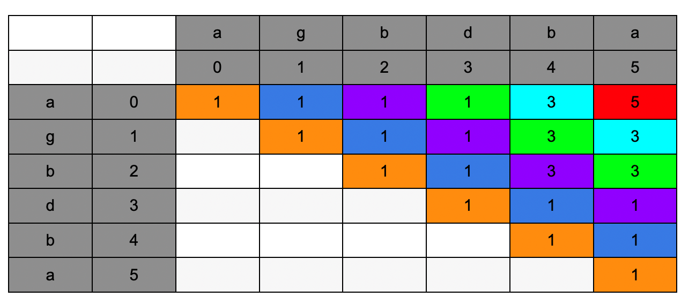

## Problem

Given a string s, find the longest palindromic subsequence's length in s.

A subsequence is a sequence that can be derived from another sequence by deleting some or no elements without changing the order of the remaining elements.

Example 1:

```
Input: s = "bbbab"
Output: 4
Explanation: One possible longest palindromic subsequence is "bbbb".
```

Example 2:

```
Input: s = "cbbd"
Output: 2
Explanation: One possible longest palindromic subsequence is "bb".
```

## Code

647



dp[i, j]表示在 i 和 j 区间内最长的回文字符串

- 如果 i 和 j 的字符相同，那么 i 和 j 之间的最长回文字符串就是[i+1, j-1] + 2
- 如果 i 和 j 的字符不同，那么 i 和 j 之间的最长回文字符串就是 max([i + 1, j], [i, j - 1])

从长度是 1 开始, 因为当长度是 1 的时候，一定是回文字符串，并且 dp = 1

```java
class Solution {
    public int longestPalindromeSubseq(String s) {
        int[][] dp = new int[s.length()][s.length()];

        for(int len = 1; len <= s.length(); len++){
            for(int i = 0; i + len <= s.length(); i++){
                int j = i + len - 1;
                if(i == j){
                    dp[i][j] = 1;
                    continue;
                }

                if(s.charAt(i) == s.charAt(j)){
                    dp[i][j] = dp[i + 1][j - 1] + 2;
                } else {
                    dp[i][j] = Math.max(dp[i + 1][j], dp[i][j - 1]);
                }
            }
        }

        return dp[0][s.length() - 1];
    }
}
```
