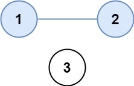

## Problem

There are n cities. Some of them are connected, while some are not. If city a is connected directly with city b, and city b is connected directly with city c, then city a is connected indirectly with city c.

A province is a group of directly or indirectly connected cities and no other cities outside of the group.

You are given an n x n matrix isConnected where isConnected[i][j] = 1 if the ith city and the jth city are directly connected, and isConnected[i][j] = 0 otherwise.

Return the total number of provinces.


Example 1:



```
Input: isConnected = [[1,1,0],[1,1,0],[0,0,1]]
Output: 2
```
Example 2:


```
Input: isConnected = [[1,0,0],[0,1,0],[0,0,1]]
Output: 3
```

## Code

DFS

```java
public class Solution {
    public int findCircleNum(int[][] isConnected) {
        int count = 0;
        boolean[] visited = new boolean[isConnected.length];
        for (int i = 0; i < isConnected.length; i++) {
            if (!visited[i]) {
                helper(isConnected, visited, i);
                count++;
            }
        }

        return count;
    }

    private void helper(int[][] matrix, boolean[] visited, int i) {
        for (int j = 0; j < matrix.length; j++) {
            if (matrix[i][j] == 1 && !visited[j]) {
                visited[j] = true;
                helper(matrix, visited, j);
            }
        }
    }
}
```

BFS

```java
public class Solution {
    public int findCircleNum(int[][] isConnected) {
        boolean[] visited = new boolean[isConnected.length];
        int count = 0;
        Queue<Integer> queue = new LinkedList<>();
        for (int i = 0; i < isConnected.length; i++) {
            if (!visited[i]) {
                queue.offer(i);
                while (!queue.isEmpty()) {
                    int s = queue.poll();
                    visited[s] = true;
                    for (int j = 0; j < isConnected.length; j++) {
                        if (isConnected[s][j] == 1 && !visited[j])
                            queue.offer(j);
                    }
                }
                count++;
            }
        }
        return count;
    }
}
```

```java
public class Solution {
   public class UnionFind {
        int[] parents;
        int[] ranks;
        int groupNum = 0;

        // one dimension
        public UnionFind(int n) {
            parents = new int[n];
            ranks = new int[n];

            for (int i = 0; i < n; i++) {
                parents[i] = i;
                ranks[i] = 1;
            }

            groupNum = n;
        }

        // two dimensions
        public UnionFind(char[][] matrix) {
            int m = matrix.length;
            int n = matrix[0].length;

            parents = new int[m * n];
            ranks = new int[m * n];

            for (int i = 0; i < m; i++) {
                for (int j = 0; j < n; j++) {
                    if (matrix[i][j] == '1') {
                        parents[i * n + j] = i * n + j;
                        groupNum++;
                    }

                    ranks[i * n + j] = 1;
                }
            }
        }

        public boolean union(int x, int y) {
            int xParent = find(x);
            int yParent = find(y);
            // same parent
            if (xParent == yParent) return false;
            // different parent
            groupNum--;
            if (ranks[xParent] > ranks[yParent]) {
                parents[yParent] = xParent;
            } else if (ranks[xParent] < ranks[yParent]) {
                parents[xParent] = yParent;
            } else {
                parents[yParent] = xParent;
                ranks[xParent]++;
            }

            return true;
        }

        public int find(int node) {
            while (node != parents[node]) {
                int parentNode = parents[parents[node]];

                parents[node] = parentNode;
                node = parentNode;
            }

            return node;
        }

        public int getGroupNum() {
            return groupNum;
        }
    }
    public int findCircleNum(int[][] isConnected) {
        int n = isConnected.length;
        UnionFind unionFind = new UnionFind(n);
        
        for (int i = 0; i < n; i++) {
            for (int j = i + 1; j < n; j++) {
                if (isConnected[i][j] == 1) {
                    unionFind.union(i, j);
                }
            }
        }
        
        return unionFind.getGroupNum();
    }
}
```
