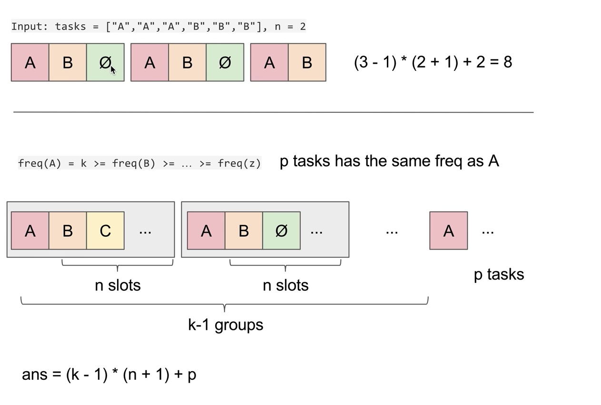
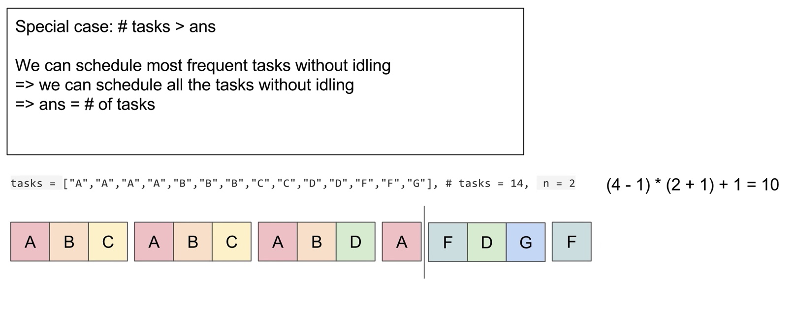

## Problem

Given a characters array tasks, representing the tasks a CPU needs to do, where each letter represents a different task.
Tasks could be done in any order. Each task is done in one unit of time. For each unit of time, the CPU could complete
either one task or just be idle.

However, there is a non-negative integer n that represents the cooldown period between two same tasks (the same letter
in the array), that is that there must be at least n units of time between any two same tasks.

Return the least number of units of times that the CPU will take to finish all the given tasks.

Example 1:

```
Input: tasks = ["A","A","A","B","B","B"], n = 2
Output: 8
Explanation:
A -> B -> idle -> A -> B -> idle -> A -> B
There is at least 2 units of time between any two same tasks.
```

Example 2:

```
Input: tasks = ["A","A","A","B","B","B"], n = 0
Output: 6
Explanation: On this case any permutation of size 6 would work since n = 0.
["A","A","A","B","B","B"]
["A","B","A","B","A","B"]
["B","B","B","A","A","A"]
...
And so on.
```

Example 3:

```
Input: tasks = ["A","A","A","A","A","A","B","C","D","E","F","G"], n = 2
Output: 16
Explanation:
One possible solution is
A -> B -> C -> A -> D -> E -> A -> F -> G -> A -> idle -> idle -> A -> idle -> idle -> A
```

## Code

idle 空闲

n表示两个相同的task之间必须**有n个间隔**

```
假设n=2, 表示相同task之间要间隔两个时间, 
比如
A和A之间必须有两个时间
假设A的频率最高, 一共有k个A
那么我们准备n+1个槽老放一组任务, 这组任务中没有重复的任务, 这样可以防止两个A之间间隔小于n
然后按照频率大小把各个任务放进这组中
因为A的频率最大,所以最后一定可以把所有的元素都放进去(这是在一般情况下, 种类比较少, 每个元素数量比较多)
最后的task的数量就是(k-1)*(n+1) + p（p表示和A频率相同的task）

特殊情况
用上面公式计算出来的总共的槽数还没有task的数量大, 表示种类很多, 不会造成重复, 因此不需要加入idle
```



特殊情况


```java
class Solution {
    public int leastInterval(char[] tasks, int n) {
        int[] dict = new int[26];
        for (char task : tasks) {
            dict[task - 'A']++;
        }

        int max = 0;
        int maxSame = 0;

        for (int num : dict) {
            if (num != 0) max = Math.max(max, num);
        }

        for (int num : dict) {
            if (num == max) maxSame++;
        }

        int res = (max - 1) * (n + 1) + maxSame;
        return Math.max(res, tasks.length);
    }
}
```
