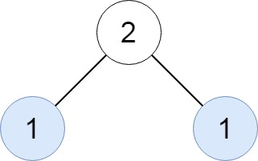

## Problem

Given the root of a binary tree, return all duplicate subtrees.

For each kind of duplicate subtrees, you only need to return the root node of any one of them.

Two trees are duplicate if they have the same structure with the same node values.


Example 1:


```
Input: root = [1,2,3,4,null,2,4,null,null,4]
Output: [[2,4],[4]]
```
Example 2:



```
Input: root = [2,1,1]
Output: [[1]]
```
Example 3:


```
Input: root = [2,2,2,3,null,3,null]
Output: [[2,3],[3]]
```
## Code

449, 297

```java
class Solution {
    Map<String, TreeNode> trees;
    Map<String, Integer> count;

    public List<TreeNode> findDuplicateSubtrees(TreeNode root) {
        trees = new HashMap();
        count = new HashMap();
        List<TreeNode> res = new ArrayList();
        helper(root);

        for (String key : count.keySet()) {
            if (count.get(key) >= 2) {
                res.add(trees.get(key));
            }
        }

        return res;
    }

    public void helper(TreeNode root) {
        if (root == null) return;
        helper(root.left);
        String encoded = encodeTreeNode(root);
        trees.put(encoded, root);
        count.put(encoded, count.getOrDefault(encoded, 0) + 1);
        helper(root.right);
    }

    private String encodeTreeNode(TreeNode root) {
        if (root == null) return "";
        StringBuilder sb = new StringBuilder();

        Queue<TreeNode> queue = new LinkedList<>();
        queue.offer(root);

        while (!queue.isEmpty()) {
            TreeNode curr = queue.poll();
            if (curr == null) {
                sb.append("null ");
                continue;
            }

            int val = curr.val;
            sb.append(val + " ");
            queue.offer(curr.left);
            queue.offer(curr.right);
        }

        return sb.toString();
    }
}
```
