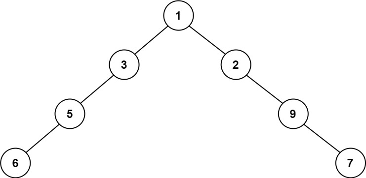
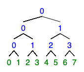

## Problem

Given the root of a binary tree, return the maximum width of the given tree.

The maximum width of a tree is the maximum width among all levels.

The width of one level is defined as the length between the end-nodes (the leftmost and rightmost non-null nodes), where the null nodes between the end-nodes are also counted into the length calculation.

It is guaranteed that the answer will in the range of 32-bit signed integer.


Example 1:


```
Input: root = [1,3,2,5,3,null,9]
Output: 4
Explanation: The maximum width existing in the third level with the length 4 (5,3,null,9).
```
Example 2:


```
Input: root = [1,3,null,5,3]
Output: 2
Explanation: The maximum width existing in the third level with the length 2 (5,3).
```
Example 3:


```
Input: root = [1,3,2,5]
Output: 2
Explanation: The maximum width existing in the second level with the length 2 (3,2).
```
Example 4:



```
Input: root = [1,3,2,5,null,null,9,6,null,null,7]
Output: 8
Explanation: The maximum width existing in the fourth level with the length 8 (6,null,null,null,null,null,null,7).
```
## Code



每个节点的子节点在它的那一行的index是2*n 和 2*n+1

```java
class Solution {
    public int widthOfBinaryTree(TreeNode root) {
        if (root == null) return 0;

        Queue<Pair<TreeNode, Integer>> queue = new LinkedList<>();
        int maxWidth = 0;

        queue.offer(new Pair<>(root, 0));

        while (!queue.isEmpty()) {
            int size = queue.size();
            int headIndex = -1;
            int tailIndex = -1;
            for (int i = 0; i < size; i++) {
                Pair<TreeNode, Integer> element = queue.poll();
                TreeNode node = element.getKey();

                int index = element.getValue();
                if (i == 0) {
                    headIndex = index;
                }

                tailIndex = index;

                if (node.left != null) {
                    queue.offer(new Pair<>(node.left, 2 * element.getValue()));
                }

                if (node.right != null) {
                    queue.offer(new Pair<>(node.right, 2 * element.getValue() + 1));
                }
            }

            maxWidth = Math.max(maxWidth, tailIndex - headIndex + 1);
        }

        return maxWidth;
    }
}
```
