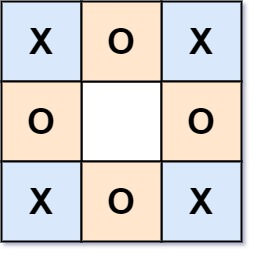

## Problem

Given a Tic-Tac-Toe board as a string array board, return true if and only if it is possible to reach this board position during the course of a valid tic-tac-toe game.

The board is a 3 x 3 array that consists of characters ' ', 'X', and 'O'. The ' ' character represents an empty square.

Here are the rules of Tic-Tac-Toe:

Players take turns placing characters into empty squares ' '.
The first player always places 'X' characters, while the second player always places 'O' characters.
'X' and 'O' characters are always placed into empty squares, never filled ones.
The game ends when there are three of the same (non-empty) character filling any row, column, or diagonal.
The game also ends if all squares are non-empty.
No more moves can be played if the game is over.


Example 1:


```
Input: board = ["O  ","   ","   "]
Output: false
Explanation: The first player always plays "X".
```
Example 2:


```
Input: board = ["XOX"," X ","   "]
Output: false
Explanation: Players take turns making moves.
```
Example 3:


```
Input: board = ["XXX","   ","OOO"]
Output: false
```
Example 4:



```
Input: board = ["XOX","O O","XOX"]
Output: true
```
## Code

```java
class Solution {
    public boolean validTicTacToe(String[] board) {
        int turns = 0;
        boolean xwin = false;
        boolean owin = false;
        int[] rows = new int[3];
        int[] cols = new int[3];
        int diag = 0;
        int antidiag = 0;

        for (int i = 0; i < 3; i++) {
            for (int j = 0; j < 3; j++) {
                if (board[i].charAt(j) == 'X') {
                    turns++;
                    rows[i]++;
                    cols[j]++;
                    if (i == j) diag++;
                    if (i + j == 2) antidiag++;
                } else if (board[i].charAt(j) == 'O') {
                    turns--;
                    rows[i]--;
                    cols[j]--;
                    if (i == j) diag--;
                    if (i + j == 2) antidiag--;
                }
            }
        }

        xwin = rows[0] == 3 || rows[1] == 3 || rows[2] == 3 ||
                cols[0] == 3 || cols[1] == 3 || cols[2] == 3 ||
                diag == 3 || antidiag == 3;
        owin = rows[0] == -3 || rows[1] == -3 || rows[2] == -3 ||
                cols[0] == -3 || cols[1] == -3 || cols[2] == -3 ||
                diag == -3 || antidiag == -3;

        if (xwin && turns == 0 || owin && turns == 1) {
            return false;
        }
        return (turns == 0 || turns == 1) && (!xwin || !owin);
    }
}
```
