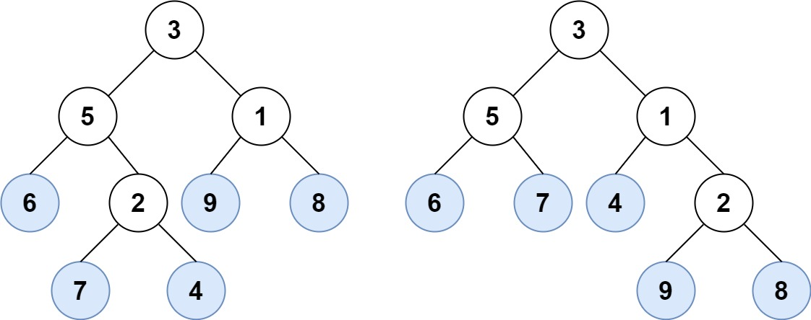

## Problem


Consider all the leaves of a binary tree, from left to right order, the values of those leaves form a leaf value sequence.


For example, in the given tree above, the leaf value sequence is (6, 7, 4, 9, 8).

Two binary trees are considered leaf-similar if their leaf value sequence is the same.

Return true if and only if the two given trees with head nodes root1 and root2 are leaf-similar.


Example 1:



```
Input: root1 = [3,5,1,6,2,9,8,null,null,7,4], root2 = [3,5,1,6,7,4,2,null,null,null,null,null,null,9,8]
Output: true
```
Example 2:
```
Input: root1 = [1], root2 = [1]
Output: true
```
Example 3:
```
Input: root1 = [1], root2 = [2]
Output: false
```
Example 4:
```
Input: root1 = [1,2], root2 = [2,2]
Output: true
```
Example 5:


```
Input: root1 = [1,2,3], root2 = [1,3,2]
Output: false
```
## Code

```java
class Solution {
    public boolean leafSimilar(TreeNode root1, TreeNode root2) {
        List<Integer> leaf1 = new ArrayList<>();
        List<Integer> leaf2 = new ArrayList<>();
        helper(root1, leaf1);
        helper(root2, leaf2);
        if (leaf1.size() != leaf2.size()) return false;
        for (int i = 0; i < leaf1.size(); i++) {
            if (leaf1.get(i) != leaf2.get(i)) return false;
        }

        return true;
    }

    private void helper(TreeNode root, List<Integer> res) {
        if (root == null) return;
        helper(root.left, res);
        if (root.left == null && root.right == null) {
            res.add(root.val);
            return;
        }
        helper(root.right, res);
    }
}
```
