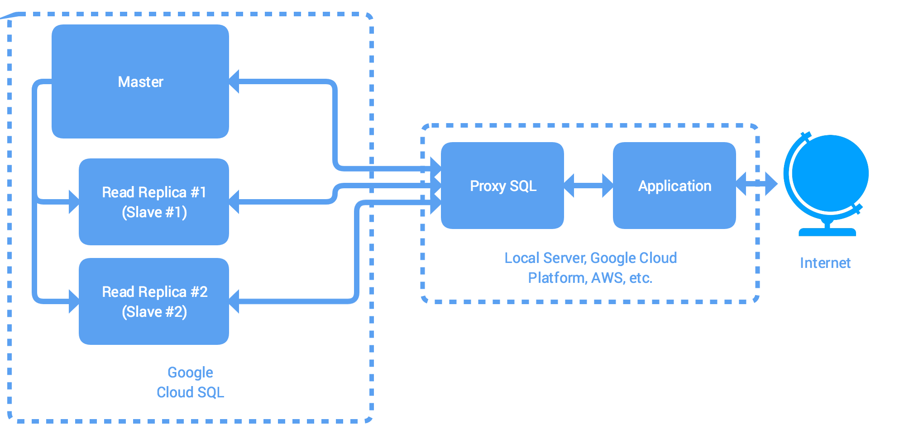

# 第一步：描述使用场景，约束和假设

把所有需要的东西聚集在一起，审视问题。不停的提问，以至于我们可以明确使用场景和约束。讨论假设。

- 谁会使用它？
- 他们会怎样使用它？
- 有多少用户？
- 系统的作用是什么？
- 系统的输入输出分别是什么？
- 我们希望处理多少数据？
- 我们希望每秒钟处理多少请求？
- 我们希望的读写比率？

# 第二步：创造一个高层级的设计

使用所有重要的组件来描绘出一个高层级的设计。

- 画出主要的 service 和连接
- 证明你的想法

# 第三步：设计核心组件

对每一个核心组件进行详细深入的分析。举例来说，如果你被问到设计一个 url 缩写服务，开始讨论：

- 生成并储存一个完整 url 的 hash
- MD5 和 Base62
- Hash 碰撞
- SQL 还是 NoSQL
- 数据库模型
- 将一个 hashed url 翻译成完整的 url
- 数据库查找
- API 和面向对象设计

# 第四步：扩展设计

确认和处理瓶颈以及一些限制。举例来说就是你需要下面的这些来完成扩展性的议题吗？

- 负载均衡
- 水平扩展

GCP: 使用 proxySQL 和 Cloud SQL 进行水平扩展

https://cloud.google.com/community/tutorials/horizontally-scale-mysql-database-backend-with-google-cloud-sql-and-proxysql

- 缓存
- 数据库分片

# 延迟与吞吐量

延迟是执行操作或运算结果所花费的时间。

吞吐量是单位时间内（执行）此类操作或运算的数量。

# 可用性与一致性

CAP 理论

- 一致性 (Consistency) ─ 每次访问都能获得最新数据但可能会收到错误响应
- 可用性 (Availability) ─ 每次访问都能收到非错响应，但不保证获取到最新数据
- 分区容错性 (Partition Tolerance) ─ 在任意分区网络故障的情况下系统仍能继续运行

网络并不可靠，所以你应要支持分区容错性，并需要在软件可用性和一致性间做出取舍

## CP ─ 一致性和分区容错性

等待分区节点的响应可能会导致延时错误。如果你的业务需求需要原子读写，CP 是一个不错的选择。

## AP ─ 可用性与分区容错性

响应节点上可用数据的最近版本可能并不是最新的。当分区解析完后，写入（操作）可能需要一些时间来传播。

如果业务需求允许最终一致性，或当有外部故障时要求系统继续运行，AP 是一个不错的选择。
