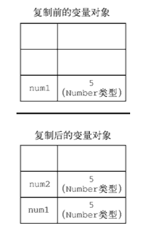

变量，作用域和内存

# 原始值和引用值

ECMAScript 变量可以包含两种不同类型的数据: 原始值和引用值。

- 原始值(primitive value)就是最简单的数据：Undefined、Null、Boolean、Number、String 和 Symbol
- 引用值(reference value)则是由多个值构成的对象，引用值是保存在内存中的对象

## 复制值

```javascript
let num1 = 5;
let num2 = num1;

let obj1 = new Object();
let obj2 = obj1;
obj1.name = "Nicholas";
console.log(obj2.name); // "Nicholas"
```

原始值赋值 到另一个变量时，原始值会被复制到新变量的位置



引用值从一个变量赋给另一个变量时，复制的是一个指针，指向同一个对象


## 传递参数

ECMAScript 中所有函数的参数都是按值传递的

```javascript
// 按值传递
function addTen(num) {
  num += 10;
  return num;
}
let count = 20;

let result = addTen(count);
console.log(count); // 20，没有变化
console.log(result); // 30

// 依然是按值传递
function setName(obj) {
  obj.name = "Nicholas"; // 按值传递，保存到obj中
  obj = new Object(); // 在函数中被销毁，不会影响外部传入的obj
  obj.name = "Greg";
}
let person = new Object();
setName(person);
console.log(person.name); // "Nicholas"
// 当 obj 在函数内部被重写时，它变成了一个指向本地对象的指针。而那个本地对象在函数执行结束时就被销毁了
```

## 确定类型

```javascript
console.log(personinstanceofObject); //变量person是Object吗?
console.log(colors instanceof Array); // 变量 colors 是 Array 吗?
console.log(pattern instanceof RegExp); // 变量 pattern 是 RegExp 吗?
```

# 执行上下文与作用域

每个上下文都有一个关联的变量对象（variable object），而这个上下文中定义的所有变量和函数都存在于这个对象上。虽然无法通过代码访问变量对象，但后台处理数据会用到它

```javascript
// 赋值为对象的 const 变量不能再被重新赋值为其他引用值，但对象的键则不受限制
const o1 = {};
o1 = {}; // TypeError: 给常量赋值
const o2 = {};
o2.name = "Jake";
console.log(o2.name); // 'Jake'

// 如果想让整个对象都不能修改，可以使用Object.freeze()
const o3 = Object.freeze({});
o3.name = "Jake";
console.log(o3.name); // undefined
```

# 垃圾回收

JS 是使用垃圾回收的编程语言，开发者不需要操心内存分配和回收

JS 基本思路很简单：确定哪个变量不会再使用，然后释放它占用的内存。这个过程是周期性的，即垃圾回收程序每隔一定时间就会自动运行

主要方法是标记清理(mark-and-sweep): 即先给当前不使用的值加上标记，再回来回收它们的内存

## 内存管理

内存优化方法

1. 将内存占用量保持在一个较小的值可以让页面性能更好。优化内存占用的最佳手段就是保证在执行代码时只保存必要的数据。如果数据不再必要，那么把它设置为 null，从而释放其引用。这也可以叫作解除引用

```javascript
function createPerson(name) {
  let localPerson = new Object();
  localPerson.name = name;
  return localPerson;
}
let globalPerson = createPerson("Nicholas");
// 解除globalPerson 对值的引用
globalPerson = null;
```

2. 通过 const 和 let 声明提升性能
3. 内存泄漏

意外声明全局变量是最常见但也最容易修复的内存泄漏问题，下面的代码没有使用任何关键字声明变量

```javascript
function setName() {
  name = "Jake";
}
```

此时，解释器会把变量 name 当作 window 的属性来创建（相当于 window.name = 'Jake'）。在 window 对象上创建的属性，只要 window 本身不被清理就不会消失。
