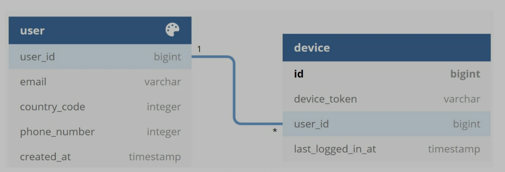
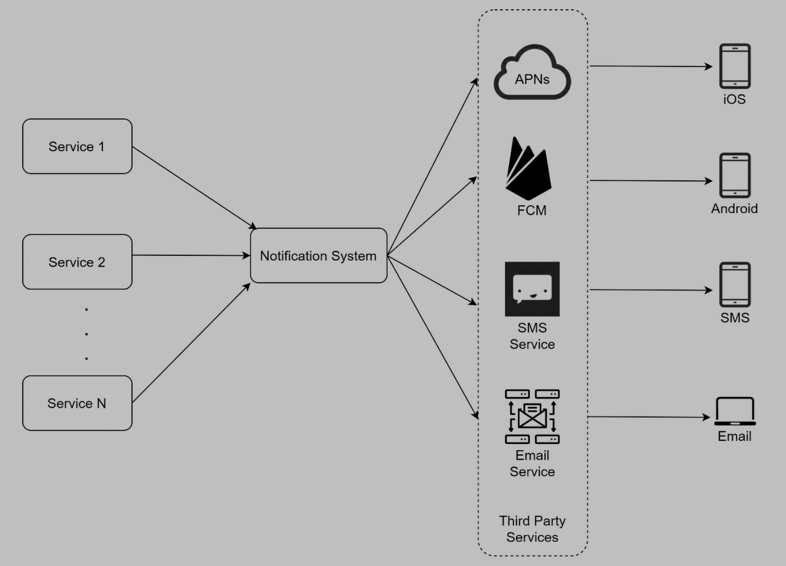
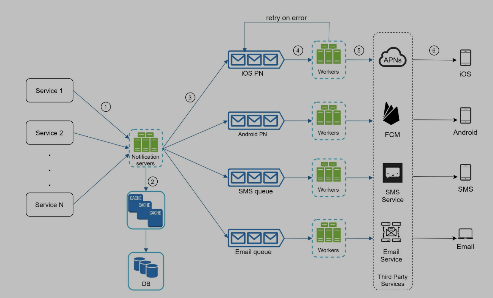
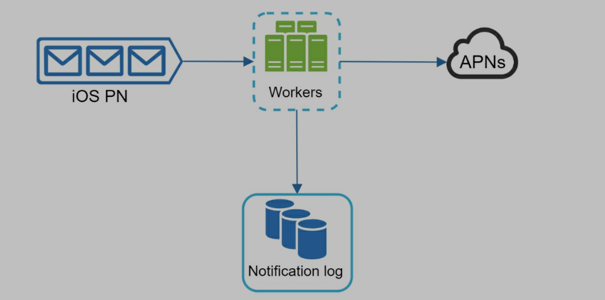

# Design a notification system

Three types of notifications:

- mobile push notification
- SMS message
- Email


# Step 1: Understand the problem and establish design scope

## 可能问的问题

- Candidate: What types of notifications does the system support?
- Interviewer: Push notification, SMS message, and email.
- Candidate: Is it a real-time system?
- Interviewer: Let us say it is a soft real-time system. We want a user to receive notifications as soon as possible. However, if the system is under a high workload, a slight delay is acceptable.
- Candidate: What are the supported devices?
- Interviewer: iOS devices, android devices, and laptop/desktop.
- Candidate: What triggers notifications?
- Interviewer: Notifications can be triggered by client applications. They can also be scheduled on the server-side.
- Candidate: Will users be able to opt-out?
- Interviewer: Yes, users who choose to opt-out will no longer receive notifications.
- Candidate: How many notifications are sent out each day?
- Interviewer: 10 million mobile push notifications, 1 million SMS messages, and 5 million emails.

# Step 2: Propose high-level design and get buy-in

- different types if notifications
- contact info gathering flow
- notification sending/receiving flow

## Different types of notifications

### IOS push notification


- provider
  - build, send notification request to Apple Push Notification Service (APNS)
  - 发送
    - device token: unique ID for sending push notifications
    - payload: push title, content....
- APNS
  - Apple service to push notification to IOS devices
- IOS
  - end client to receive notifications

### android push notification


与 ios 类似, 但是使用 FCM

### SMS message


SMS messages 通常使用第三方服务, 比如 Twilio, Nexmo 等

### Email

可以选择一些第三方的 email service, 比如 sendgrid, Mailchimp. 提供 delivery rate 和 data analytics


Design including all third-party service


## Contact info gathering flow

需要获取 mobile device tokens, phone number, email address... 当用户第一次安装并且注册 app 的时候, API servers 手机用户的信息并存在 db 中


db tables



## Notification sending/receiving flow

### high-level design



- service 1 to N
  - service 可以是 microservice, cron job, distributed system...
- notification system
  - provides API for service 1 to N
  - build notification payload for third-party services
- third-party services
  - deliver notification to users
  - 注意 extensibility
  - 注意某些 third-party service 在某些地区可能不能用
- IOS, Android, SMS, Email
  - users receive notification on devices

存在的问题:

- single point of failure, 只有一个 server
- hard to scale
- performance bottleneck

### high-level design - improved

- move db and cache out of the notification server
- add more servers and set up automatic horizontal scaling
- introduce message queue to decouple the system components



- service 1 to N: different services send notifications via APIs provided by notification servers
- Notification servers
  - provide APIs for services to send notifications
  - basic validations for emails, phone numbers...
  - query db or cache to get needed data to render a notification
  - put notification data to message queues for parallel processing
- cache
  - user info, device info, notification templates are cached
- DB
  - stores data about users, notification, settings...
- message queue
  - remove dependencies between components
  - server as buffers when high volumes of notifications
  - each type of notification is assigned to a distinct message queue
- workers
  - pull notification events from message queues
  - send message to third-party services
- third-party service
- IOS, Android, SMS, Email

API 举例

POST https://api.example.com/v/sms/send

request body

```json
{
  "to": [
    {
      "user_id": 123456
    }
  ],
  "from": {
    "email": "from_address@example.com"
  },
  "subject": "hello world",
  "content": {
    "type": "text/plain",
    "value": "hello world"
  }
}
```

工作流程

- a service call APIs provided by notification servers
- notification servers fetch metadata, like user info, device token, and notification setting from cache or db
- notification event is sent to corresponding queue for processing
- workers pull notification events from message queues
- workers send notifications to third party services
- third-party service send notifications to user devices

# Step 3: Design deep dive

## Reliability

### how to prevent data loss?



- save notification data in db
- implement retry mechanism
- notification log database for data persistence

### will recipients receive a notification exactly once?
