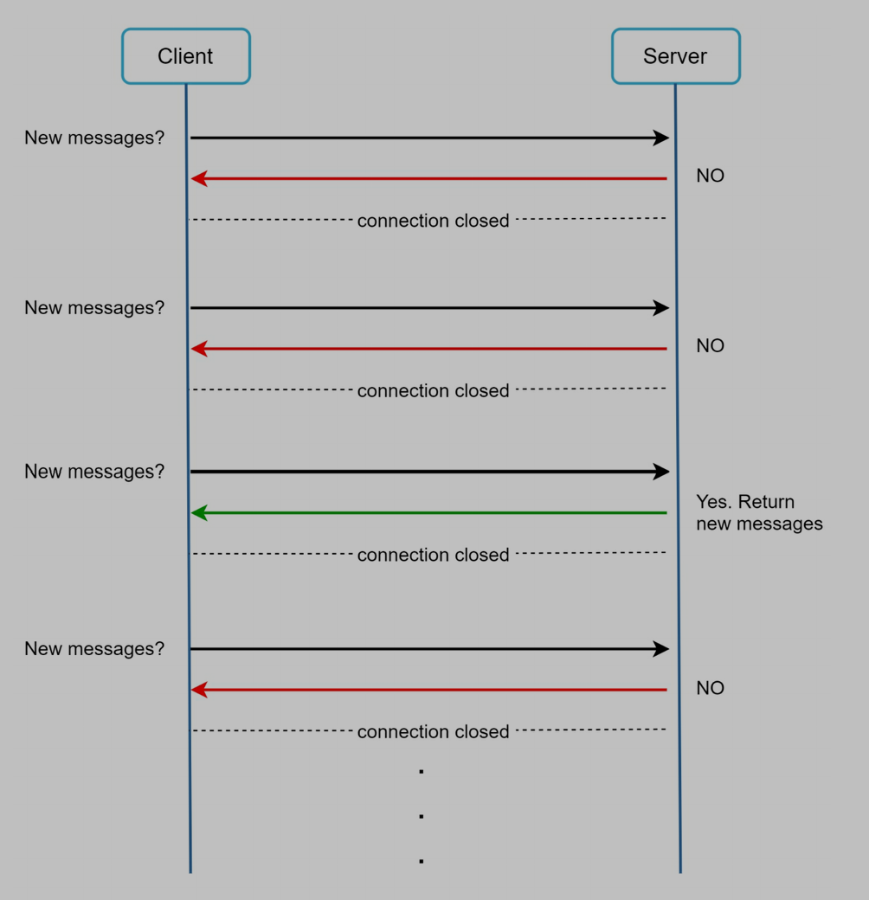
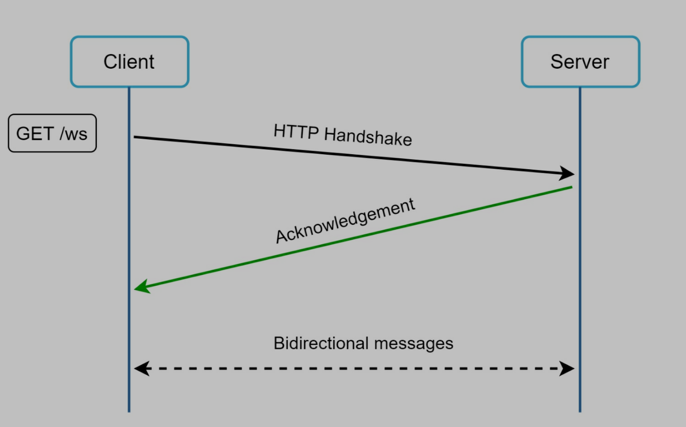
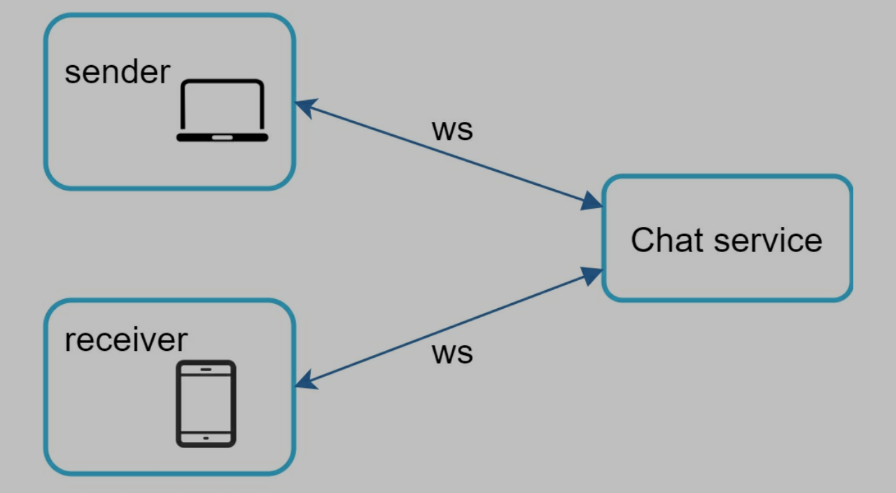
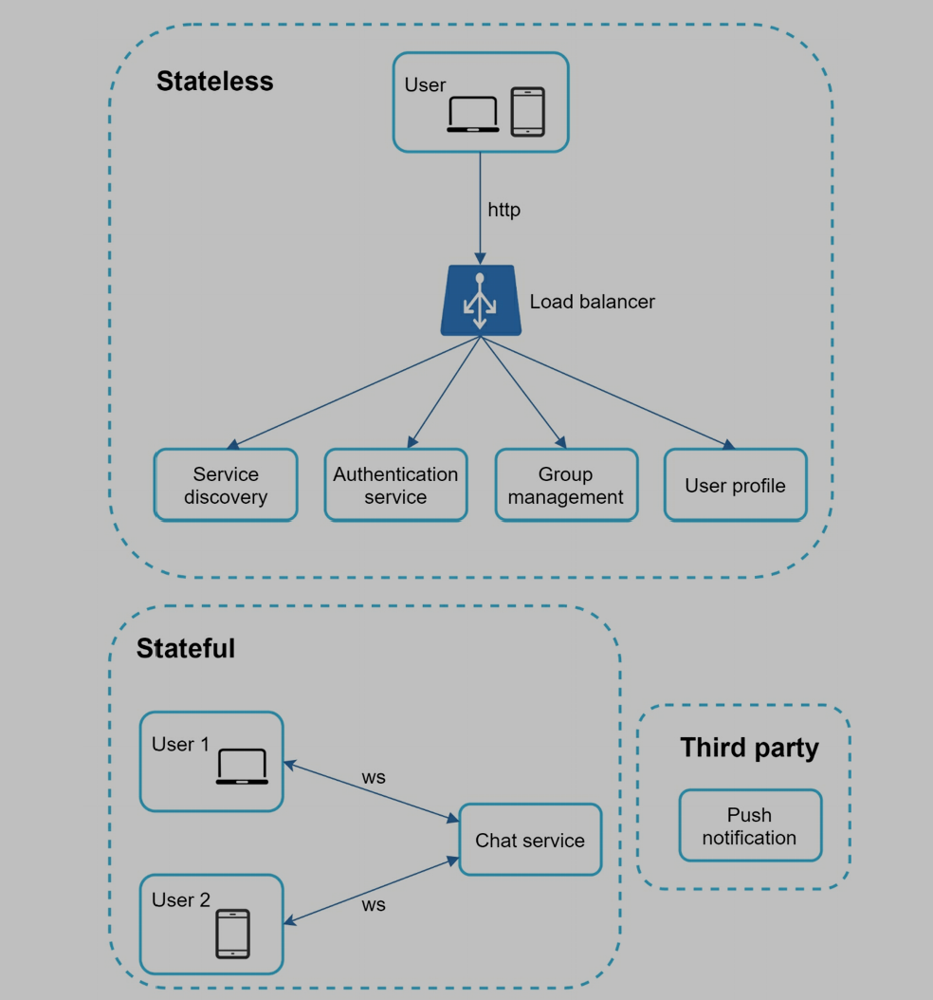
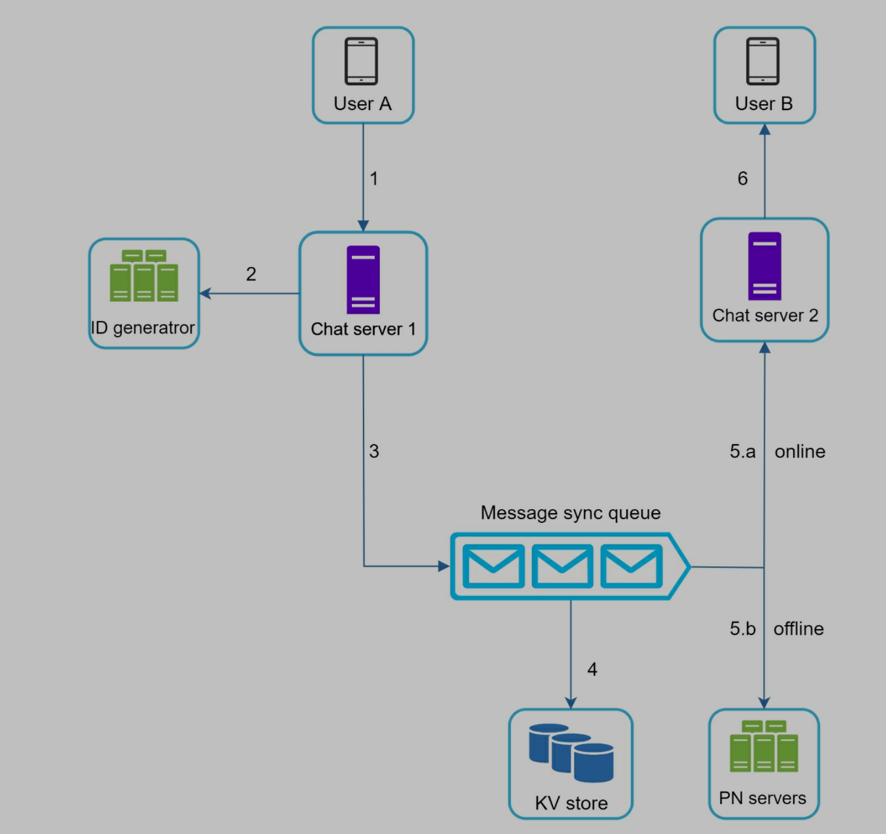
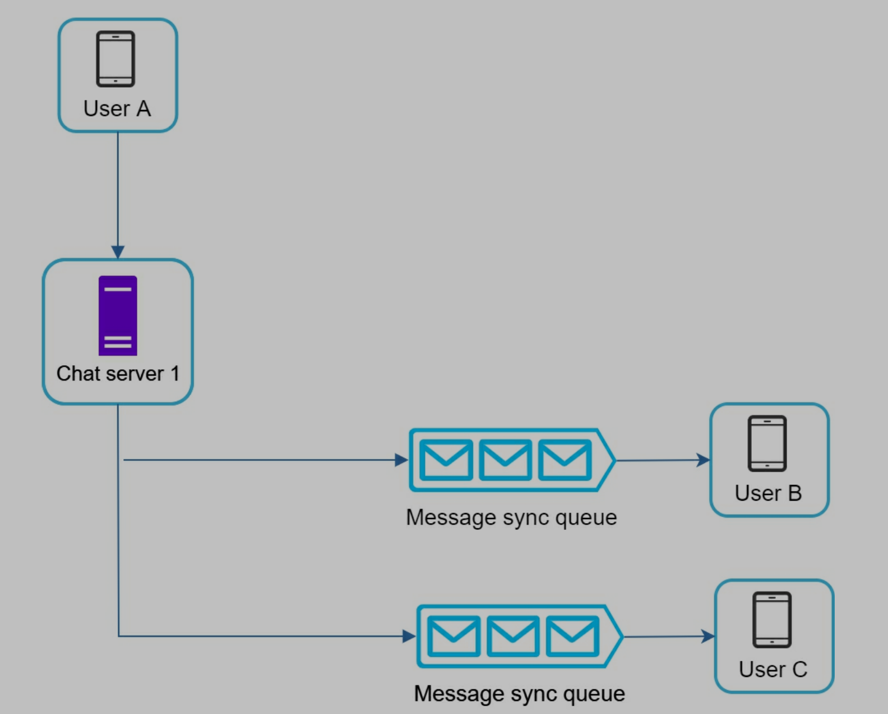

# Step 1: Understand the problem and establish design scope

- Candidate: What kind of chat app shall we design? **1 on 1 or group** based?
- Interviewer: It should support both 1 on 1 and group chat.
- Candidate: Is this a mobile app? Or a web app? Or both?
- Interviewer: Both.
- Candidate: What is the scale of this app? A startup app or massive scale?
- Interviewer: It should support 50 million daily active users (DAU).
- Candidate: For group chat, what is the group member limit?
- Interviewer: A maximum of 100 people
- Candidate: What features are important for the chat app? Can it support attachment?
- Interviewer: 1 on 1 chat, group chat, online indicator. The system only supports text messages.
- Candidate: Is there a message size limit?
- Interviewer: Yes, text length should be less than 100,000 characters long.
- Candidate: Is end-to-end **encryption** required?
- Interviewer: Not required for now but we will discuss that if time allows.
- Candidate: How long shall we store the chat history?
- Interviewer: Forever.

## 重点 features

- a one-on-one chat with low delivery latency
- small group chat (max of 100 people)
- online presence
- multiple device support, same account log in to different devices
- push notification
- support 50 million DAU

# Step 2: Propose high-level design and get buy-in

- clients do not communicates directly with each other
- each client connects to chat service
- chat service
  - receive messages from clients
  - find right recipients for each message and relay the message to the recipients
  - if a recipient is not online, hold the messages until she is online

问题: HTTP is client-initiated, how to send message? Many techniques are used to simulate a server-initiated connection: polling, long polling, and WebSocket.

## Polling

- client periodically ask the server if there are messages available
- costly, inefficient

## long polling

- client holds the connection open until new message available or timeout
- when client receives new messages, it immediately sends another request to the server, restarting the process
- 缺点
  - sender and receiver may not connect to the same chat server.
  - server cannot tell if a client is disconnected
  - inefficient

## WebSocket

- most common solution for sending asynchronous updates from server to client
- initiated by client
- bi-directional and persistent
- a server can send updates to clients
- efficient

## high-level design

- 只有聊天的部分需要 webSocket, 其他部分继续使用 HTTP

### stateless services

- manage login, signup, user profile...
- load balancer routes requests to correct services

### stateful service

- each client maintains a persistent network connection to a chat server
- service discovery coordinates with chat service to avoid server overloading

### third-part integration

check chapter 10

- push notification
- inform users when new messages have arrived

### scalability

- chat servers send/receive messages
- presence servers manage online/offline status
- API servers handle login, signup, profile...
- notification server
- key-value store saves chat history

### Storage

two types of data

- generic data
  - profile, setting , user friend list...
  - relational db
  - replication, sharding
- chat history data
  - enormous data (facebook, 60 billion messages a day)
  - only recent chats are accessed frequently
  - need to support search, view your mentions, jump specific messages...
  - read to write ratio is about 1:1

选用 key-value store 的原因

- easy horizontal scaling
- low latency
- relational db do not handle long tail of data. When indexes grow, random access is expensive
- popular chat apps are using it (facebook - hbase, discord - cassandra)

## Data models

### message table for 1 on 1 chat

message_id is used to decide message sequence

### message table for group chat

composite primary key: (channel_id, message_id)

### message ID

要求

- unique
- sortable by time, new rows have higher IDs than old ones

解决方案

- NoSQL db 通常没有 auto_increment
- 64bit sequence number generator (Chapter 7)
- local sequence number generator
  - IDs are only unique within a group
  - sufficient

# Step 3: Design deep dive

## Service discovery

- recommend the best chat server for a client
- based on criteria like geographical location, server capacity
- Apache Zookeeper is a solution
  - register all available chat servers
  - picks the best chat server for a client based on predefined criteria

workflow

1. user tries to log in
2. load balancer sends login request to API servers
3. after authentication, service discovery finds the best chat server for the user (server 2 is the best now), and return to the user
4. user connect chat server 2 through WebSocket

## Message flows

### 1 on 1 chat flow

1. user a send a chat message to chat server 1
2. chat server 1 requests a message ID from ID generator
3. chat server 1 sends the message to the message sync queue
4. save message in key-value store
5. user b
   1. if user b is online, message is forwarded to char server 2 (user b connected with WebSocket)
   2. is user b is offline, push notification (PN) servers send a notification
6. chat server 2 sends message to user b

### message synchronization across multiple devices

如上图,

- user a has two devices
- when user log in devices, it establish a WebSocket connection with Chat server 1
- each device maintains a variable cur_max_message_id, which keeps track of the latest message ID on the device
- messages are considered as new when
  - recipient ID is equal to the currently logged-in user ID
  - message ID in key-value store is larger than cur_max_message_id

### small group chat flow

- user a sends a message
- message is copied to each group member's message sync queue
- message sync queue is an inbox for a recipient
- it is good for small group
  - it simplifies message sync flow as each client only needs to check inbox to get new message
  - when group number is small, storing a copy in each recipient's inbox is not too expensive
- each recipient can receive message from multiple users.
- each recipient has an inbox which contains messages from different senders

wechat uses a similar approach. However, for large group, storing a message copy for each member is not acceptable.

### online presence

some flows will trigger online status change

- user login
  - when WebSocket connection is built
  - status and last_active_at are saved to KV store
- user logout
  - online status is changed to offline in KV store
  - presence indicator shows a user is offline

### user disconnection

- 用户很可能频繁断线, 重连, 断线, 重连...
- update online status in db for every disconnect/reconnect is too often
- 解决方法 heardbeat mechanism
  - periodically, client sends a heartbeat to presence servers
  - if presence servers receive a heartbeat event in a certain time -> online

### online status fanout

How do user a's friends know about the her status?

- presence servers use publish-subscribe model
- each friend pair maintains a channel
- when a online status changes, it publishes the event to three channels
- three channels are subscribed by b, c, d
- client and servers uses WebSocket
- it is good enough for small group, but not good for large group

# Step 4: Wrap up

- chat servers for real-time messaging
- presence servers for managing online status
- push notification servers for sending notifications
- key-value stores for chat history
- API servers for other functionalities

其他话题

- extend chat app to support media files
  - compression
  - cloud storage
  - thumbnails
- end-to-end encryption
- caching message on client-side
- improve load time
- error handling
  - chat server error
  - message resent mechanism - retry and queue
