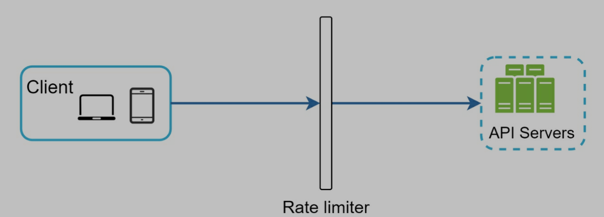
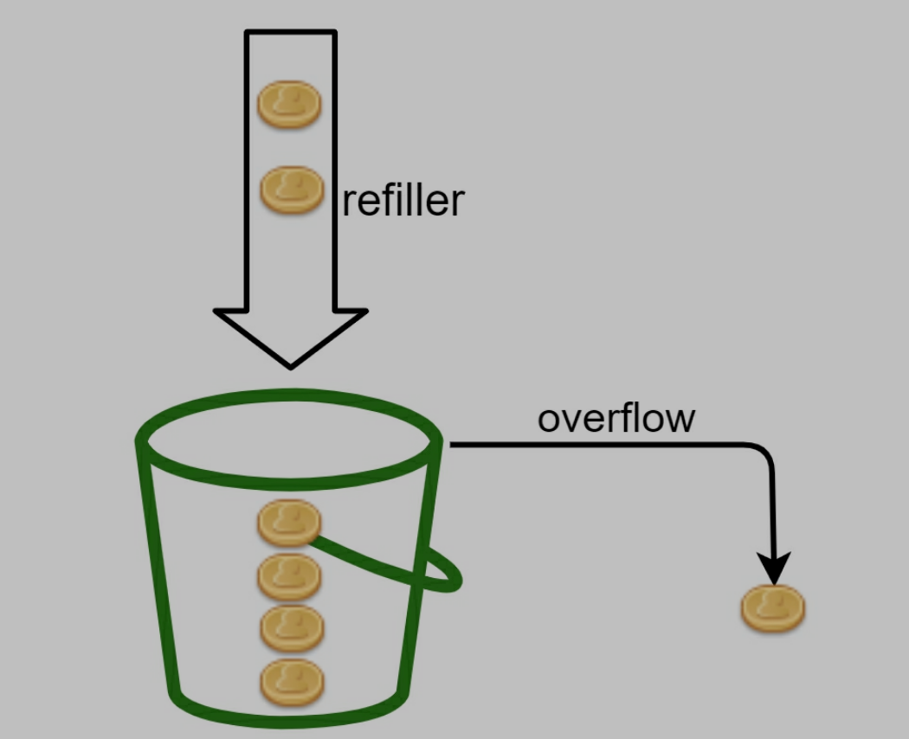
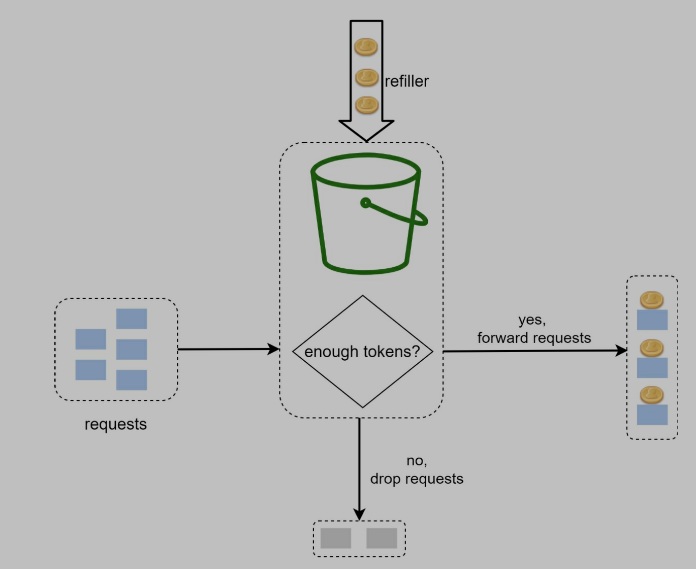
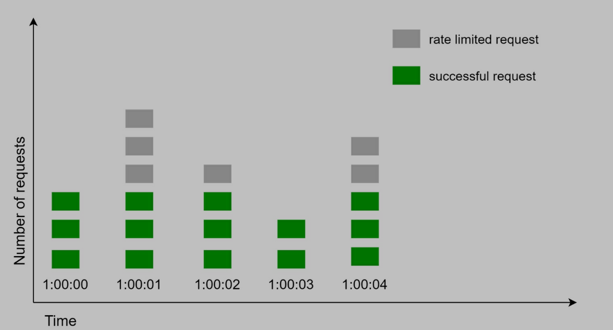
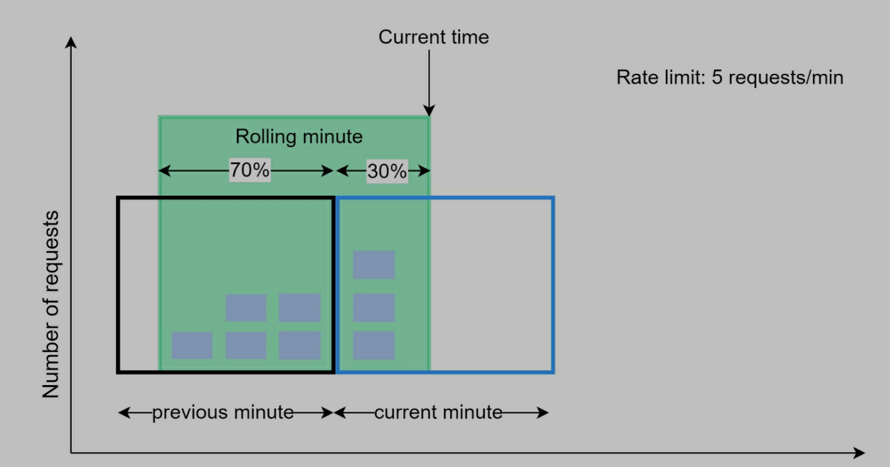
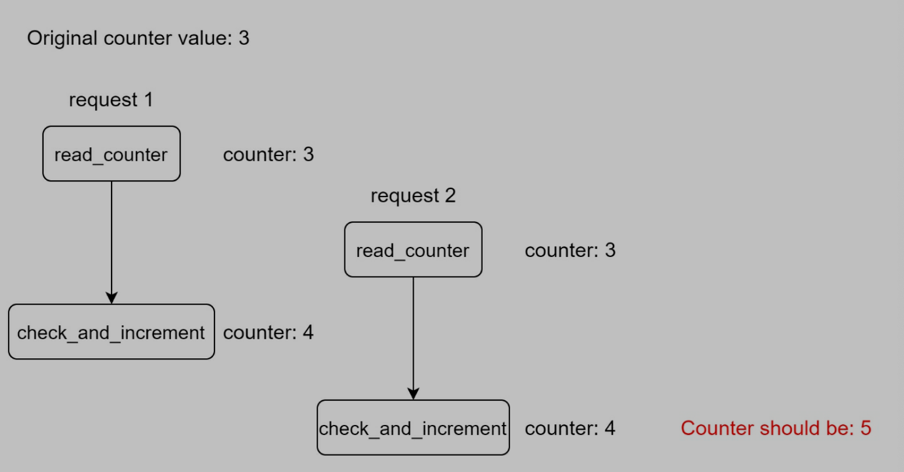
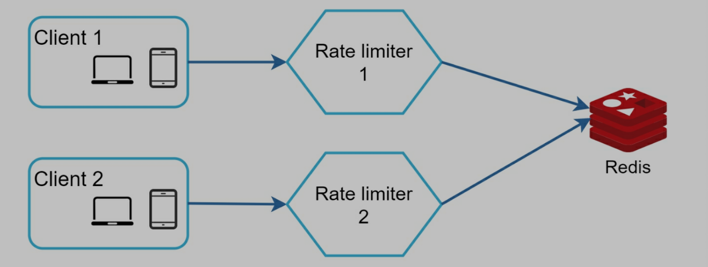

# Design a Rate Limiter

# What is a Rate Limiter?

## Definition

> In a network system,
> a rate limiter is used to control the rate of traffic sent by a client or a service.
> In the HTTP world,
> a rate limiter limits the number of client requests allowed to be sent over a specified period.

## Example

- User cannot send 2 posts per second
- User cannot create more than 10 accounts from same IP address
- User cannot claim rewards more than 5 times per week

## Rate limiter benefits

- Prevent **Denial of Service (DoS)** attack: Flood the targeted machine or resource with superfluous requests in an attempt to overload systems and prevent some or all legitimate requests
- Reduce cost
- Prevent servers from being overloaded

# Step 1 - Understand the problem and establish design scope

## Questions

- Candidate: What kind of rate limiter are we going to design? Is it a client-side rate limiter or server-side API rate limiter?
- Interviewer: Great question. We focus on the **server-side API rate limiter**.
- Candidate: Does the rate limiter throttle (节流) API requests based on IP, the user ID, or other properties?
- Interviewer: The rate limiter should be flexible enough to support different sets of throttle rules.
- Candidate: What is the scale of the system? Is it built for a startup or a big company with a large user base?
- Interviewer: The system must be able to handle a large number of requests.
- Candidate: Will the system work in a distributed environment?
- Interviewer: Yes.
- Candidate: Is the rate limiter a separate service or should it be implemented in application code?
- Interviewer: It is a design decision up to you.
- Candidate: Do we need to inform users who are throttled?
- Interviewer: Yes.

## Requirements

- Accurately limit excessive requests
- Low latency. The rate limiter should not slow down HTTP response time
- Use as little memory as possible
- Distributed rate limiting. The rate limiter can be shared across multiple servers or processes.
- Exception handling. Show clear exceptions to users when their requests are throttled.
- High fault tolerance. If there are any problems with the rate limiter (for example, a cache server goes offline), it does not affect the entire system.

# Step 2 - Propose high-level design and get buy-in

## 2.1 Where to put the rate limiter?

- Client-side rate limiter is not secure and hard to implement
- Server-side rate limiter - OK
- Rate limiter middleware - OK
  - API gateway
    - **Cloud microservices** have become widely popular and rate limiting is usually implemented within a component called **API gateway**.
    - An API gateway **takes all API calls from clients, then routes them to the appropriate microservice** with request routing, composition, and protocol translation.
    - An API gateway is a fully managed service that supports **rate limiting, SSL termination, authentication, IP whitelisting, servicing static content**, etc. For now, we only need to know that the **API gateway is a middleware** that supports rate limiting.





https://cloud.google.com/api-gateway

### Server-side or middleware?

- Depends on technology stack, engineering resources, priorities, goals...
- Limiting algorithm: business needs
- If we already have microservice architecture and API gateway, we only need to add rate limiter to API gateway
- Cost: commercial API gateway is a better option if no enough resources

## 2.2 Rate limiting algorithm

### 2.2.1 Token bucket (widely used for rate limiting)

- Two parameters
  - Bucket size: max token number
  - Refill rate: how many tokens put into a bucket periodically
- Put tokens into a bucket, like 4 tokens/min
- Every request consumes a token
- When a request comes in, check if we have tokens
  - If we have, assign a token to the request, and move on
  - If not, the request is dropped
- Different APIs with different buckets cause they have different rate limits
- IP address + bucket is also an option
- If system has a limit, like 10000 request/sec, we can set up a global bucket
- Pros
  - Simple
  - Memory efficient
  - Token bucket allows a burst of traffic for short periods. A request can go through as long as there are tokens left.
- Cons
  - Hard to know the best values of the two parameters





### 2.2.2 Leaking bucket

- Two parameters
  - bucket size: max request in queue
  - outflow rate: max request handle/min
- Similar to token bucket, but use first-in-first-out(FIFO) queue
- When a request comes in, check if queue is full
  - If not, put the request into queue
  - If it is, the request is dropped
  - Requests are pulled from the queue and processed at regular intervals.
- Pros
  - memory efficient
  - Requests are processed at a fixed rate therefore it is suitable for use cases that a stable outflow rate is needed
- Cons
  - **A burst of traffic** fills up the queue. If they are not processed in time, recent requests will be rate limited.
  - Hard to know the best values of the two parameters


### 2.2.3 Fixed window counter

- Set up
  - Fix-sized time windows
  - A counter for each window
- When a request comes in
  - Increase counter
  - When counter increases to threshold, request is dropped
- Pros
  - Memory efficient
  - Easy understanding
  - Fit in certain conditions
- Cons
  - **A burst of traffic** is at the edge of a time window, some requests will be rate limited



One time window per second, counter is 3


- 00 - 01 - 5 requests;
- 01 - 02 - 5 requests;
- 00:30 - 01:30 - 10 requests, rate limited!

### 2.2.4 Sliding window log

- Save request timestamp in log file
- When a request comes in
  - Add timestamp to the request
  - Remove all outdated timestamps (outdated timestamp = current timestamp - time window)
  - If log size is larger than count, request is dropped
- Pros
  - Accurate
  - Solve fixed window counter issue. A burst of traffic is at the edge of a time window is not a problem
- Cons
  - Consume memory, save timestamp to log for evert request


- Allow 2 requests/min
- 1:01:40 - 1 request - valid window: [1:00:40 - 1:01:40)
- Requests before 1:00:40 are outdated (1:00:01 - 1:00:30), removed from log (1:00:01, 1:00:30)
- After removing, log size is 2 (1:00:50 is saved into log even it is dropped)

### 2.2.5 Sliding window counter

- A combination of fixed window counter and sliding window log
- Calculate requests number based on rolling window
- Pros
  - Smooth traffic
  - Memory efficient
- Cons
  - Hard to know the best values of parameters



- Assume max 7 requests/min
- Requests in current window(3) + requests in the previous window(5) \* overlap percentage of the rolling window and previous window (0.7)
- 3 + 5 \* 0.7 = 6.5 (max is 7, so the request is good)

## 2.3 High-level architecture

- A variety of algorithms, but the main idea is counting request numbers
- Save counter into in-memory cache(like redis) to improve performance
  - Redis: INCR (+1) and EXPIRE functions
- Workflow
  - Request -> rate limiter middleware
  - Rate limiter middleware -> redis (counter)
  - Check if limit is reached
    - reached: request is dropped
    - not reached: send request to server, increase counter in redis


# Step 3 - Design deep dive

> Two problems for current design

1. How to create and store rate limiting rules
2. How to handle requests that are rate limited

## 3.1 Rate limiting rules

> Saves rate limiting rules on disk

Allow a maximum of 5 marketing messages per day.

```yaml
domain: messaging
descriptors:
  - key: message_type
    Value: marketing
    rate_limit:
      unit: day
      requests_per_unit: 5
```

Users cannot login 5 times per minute.

```yaml
domain: auth
descriptors:
  - key: auth_type
    Value: login
    rate_limit:
      unit: minute
      requests_per_unit: 5
```

## 3.2 handle requests exceeding the rate limit

### 3.2.1 Two ways

1. Return 429 status code
2. Put exceeding requests into a job queue, and handle later

### 3.2.2 Rate limiter headers

可以在 response 的 header 中加入一些信息, 告诉 client 超过了限制次数

> We can put info about rate limit into response header

- X-Ratelimit-Remaining: remaining number of allowed requests within the window
- X-Ratelimit-Limit: many calls the client can make per time window
- X-Ratelimit-Retry-After: number of seconds to wait until you can make a request again without being throttled

## 3.3 Current design


- Store rules on the disk
- Workers frequently pull rules from the disk and store them in the cache
- When a request comes in, request are sent to rate limiter middleware
- Rate limiter middleware
  - Load rules from cache
  - Fetch counter from redis
- If request < counter, send request to server
- If request > counter
  - Rate limiter returns 429 status code
  - Request is dropped or put into a job queue

## 3.4 Rate limiter in a distributed environment

### 3.4.1 Race condition

- Happen in highly concurrent environment
  - Assume counter=3
  - Two requests read counter from Redis at the same time
  - After that, count is updated to 4, but it should be 5
- Common solution
  - Lock
  - System becomes slow
- Better solution
  - Lua script and sorted sets data structure in Redis



### 3.4.2 Synchronization issue

- Multiple rate limiter servers
- Since web tier is stateless, client can send request to any rate limiter server. The counter is not right in some cases.
- Solution: centralized data stores, like using Redis




## 3.5 Performance optimization

- Multi-data center
  - Reduce latency
  - Latency is the time it takes for data to be transferred between its original source and its destination
- Synchronize data with an eventual consistency model

## 3.6 Monitoring

- Check if rate limiting algorithm is effective
- Check if rate limiting rules are effective
- If rules are too strict -> relax rules
- Rate limiter becomes ineffective when there is a sudden increase in traffic like flash sales. In this case, we can replace the algorithm to support burst traffic. Token bucket is a good fit here.

# Step 4 - Wrap up

- Discuss pros and cons for algorithms
- Discuss system architecture, distributed environment, performance optimization, monitoring...
- Discuss hard vs soft rating limiting
  - Hard: number of requests cannot exceed the threshold
  - Soft: requests can exceed the threshold for a short period
- Rate limiting at different levels
- Avoid being rate limited
  - Use client cache to avoid making frequent API calls
  - Don't send too many requests in a short time
  - Catch exceptions
  - Retry logic
