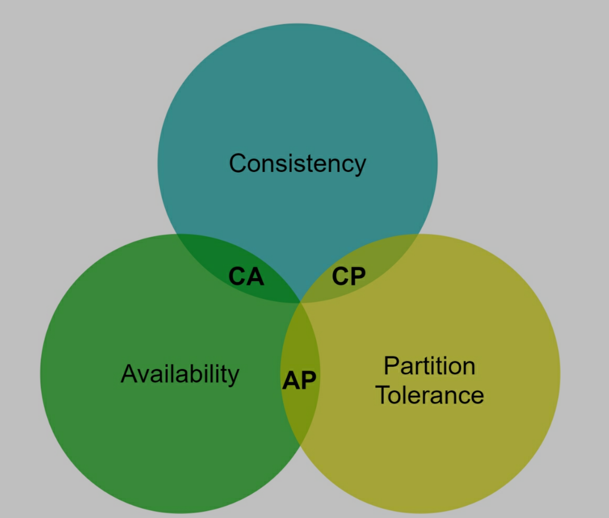
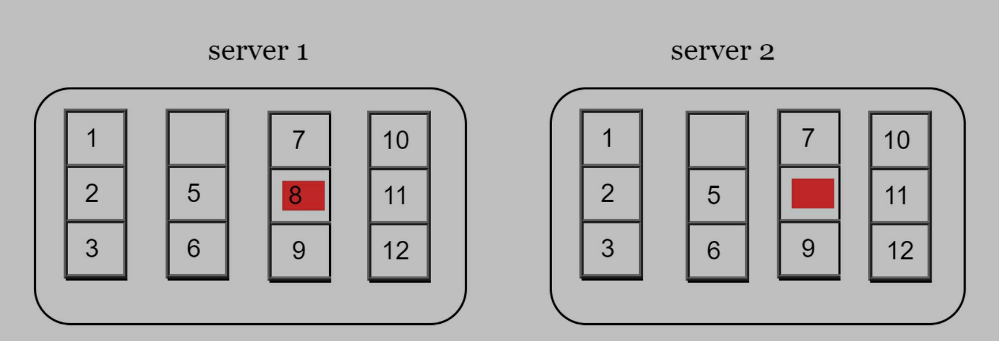
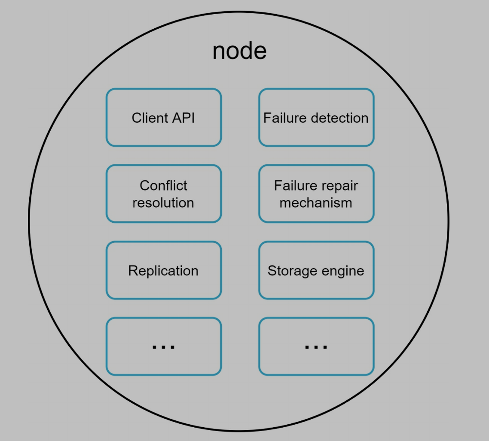
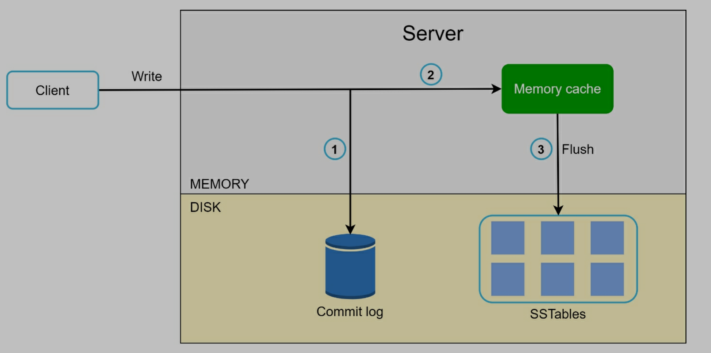
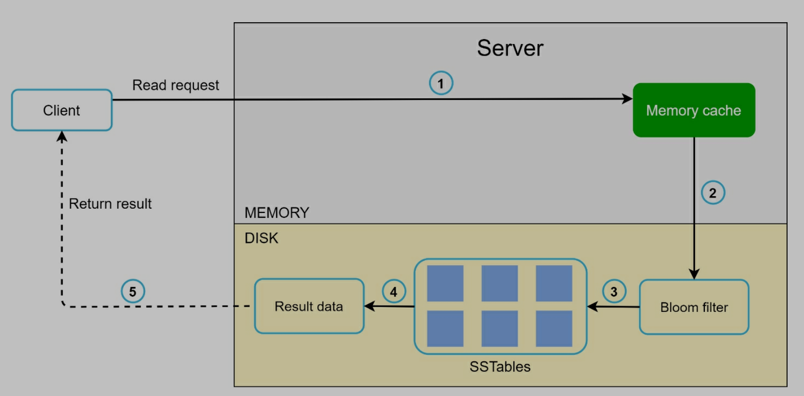
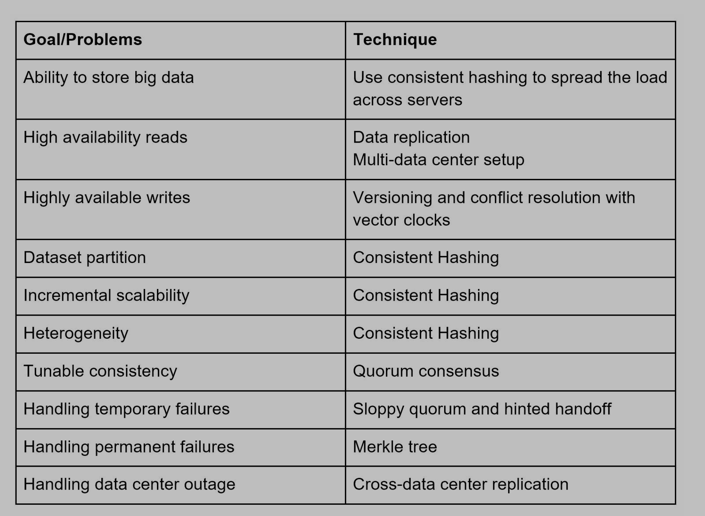

# Design A Key-Value Store

> Popular key-value store system

- Dynamo
- Cassandra
- BigTable

# Step 1 - Understand the problem and establish design scope

> Design is the tradeoffs

- Read/Write/Memory
- Consistency/Availability

> key-value store requirements

- Size of a key-value pair is small: less than 10 KB
- Ability to store big data
- High availability: system responds quickly, even during failures
- High scalability: system can be scaled to support large data set
- Automatic scaling: addition/deletion of servers should be automatic based on traffic
- Tunable consistency
- Low latency

# Step 2 - Propose high-level design and get buy-in

## 2.1 Single server key-value store

- Store key-value pairs in a hash table
- In memory
- Optimization
  - Data compression
  - Store only frequently used data in memory and the rest on disk

## 2.2 Distributed key-value store (distributed hash table)

> CAP theorem (consistency, availability, partition tolerance).
> CAP is crucial for distributed system

- Impossible to guarantee CAP simultaneously
- Consistency: all clients see same data at same time
- Availability: clients can get responses, even some servers are down
- Partition tolerance
  - Partition: **communication break** between two nodes
  - Partition tolerance: system is still working, even network partition
- Ideal situation
  - Network partition never happen
  - Write to n1, n2 and n3 are updated (CA)
- Real-world distributed system
  - Partition will happen
  - When partition happens, We have to choose between consistency and availability
- **We have to choose between consistency and availability since partition cannot be avoid**

> As shown in the images above

- n3 is offline, it cannot communicate with n1 and n2
- If client write to n1 or n2, n3 cannot get update.
- If client write to n3 before offline, but data has not been updated to n1 and n2, then n1 and n2 cannot get update
- Select consistency (CP)
  - Stop all writes to n1 and n2 to avoid inconsistency in n1, n2, n3
  - System will be unavailable
  - Some bank systems do this until problems solved
- Select availability (AP)
  - System accepts read requests even data is inconsistent
  - n1, n2 can write. When system recovered, send data to n3

# Step 3 - Design deep dive

## 3.1 Data partition

> big data -> split data -> save to different servers

Two problems

1. How to distribute data evenly?
2. how to reduce data movement when adding and removing servers?

> We can use consistent hashing to solve the problems

## 3.2 Data replication

> To achieve high **availability and reliability**, data must be replicated asynchronously over N servers, where N is a configurable parameter.

- We we have a key, walk clockwise, find the first N servers and save data copies
- First N servers might have virtual nodes, so we only select first N real servers
- For reliability, we save data in data centers in case of one data center is offline

## 3.3 Consistency

> Since data is replicated at multiple nodes, it must be synchronized across replicas.replicas. Quorum consensus (共识) can guarantee consistency for both read and write operations.

- N, replicas number
- W, write quorum of size W. At least W replicas ack writes means success
- R, read quorum of size R. At least R replicas return read means success
- N, W, R are tradeoff of consistency and latency
- Large W, R, consistency is good, speed is bad because we have to wait for more servers' responses

> Example: N = 3. When W = 1, meaning we only need to get 1 write ack, then we can return to client. We don't have to wait for 3 servers

## 3.4 Consistency models

> A consistency model defines the degree of data consistency. We list 3 models

- Strong consistency model: **all** reads will get latest data, data never out-of-date
  - Don't accept read/write until all replicas updated
  - Not highly available because it will block the following requests
- Weak consistency model: **some** reads will not get latest data
- **Eventual consistency model**: a special weak consistency. All reads get updated after a while
  - Dynamo, Cassandra use it
  - When concurrent writes happen, eventual consistency uses **reconciliation** method to force clients make data consistent

## 3.5 Inconsistency resolution: versioning

### 3.5.1 How inconsistency happen?

- Ar first, Replica nodes n1, n2 have same data. Then server1 updates name, server2 updates name. We have inconsistency.
- Replication -> high availability; Replicas -> inconsistency

### 3.5.2 How to resolve inconsistency?

#### 3.5.2.1 Versioning and vector clocks

- Versioning: treat data modification as immutable version of data
- Vector clock: data items have [server, version]

#### 3.5.2.2 How it work?

- Current vector clock is D([s1, v1], [s2, v2], ..., [sn, vn]), D is data item, v1 is version counter, s1 is server number...
- If write D to si, we will do:
  - Increase vi if [si, vi] is existing
  - Otherwise, create [si,1]

1. Client A write D1, sx take it, then we have D1[(sx, 1)]
2. Client B read latest D1, update to D2, sx take it. D2 override D1, then we have D2([sx, 2])
3. Client C read latest D2, update to D3, sy take it, then we have D3([sx, 2], [sy, 1])
4. Client D read latest D2, update to D4, sz take it, then we have D3([sx, 2], [sz, 1])
5. Client E read latest D3 and D4, find conflict, because D2 is updated by sy and sz. Conflict is resolved by client, and update to server.Suppose sx take it, then we have D5([sx, 3], [sy, 1], [sz, 1]).

#### 3.5.2.3 Pros and cons

- Pros
  - We can have order of versions, like D([s0, 1], [s1, 1]) is before D([s0, 1], [s1, 2]) (no conflict for now)
  - We can know if we have conflict, like D([s0, 1], [s1, 2]) and D([s0, 2], [s1, 1]) means conflict
- Cons
  - Complexity
    - Clients have to resolve conflict
    - We have to implement conflict resolution logic
  - Number of [server, version] will increase rapidly. We can set up a threshold to delete old data

## 3.6 Handling failures

### 3.6.1 Failure detection

> In distributed system, usually, it requires at least 2 independent sources of information to mark a server down.

#### 3.6.1.1 Solution 1: All-to-all

- Workable
- inefficient

#### 3.6.1.2 Solution 2: Decentralized failure detection methods - **gossip protocol**

- Every node save a node list, including id, heartbeat counters
- Every node increase counter periodically
- Every node send heartbeat to some random nodes
- When node receive heartbeat, node list is updated
- If heartbeat counter does not increase in a period, that node is marked as down

- s0 save a node list
- s0 find s2 heartbeat counter does not increase for a long time
- s0 send heartbeat to some random nodes, including s2. Other nodes make sure s2 heartbeat does not increase in their lists for a long time. Then, we mark s2 as down
- s2 is down info is updated to other nodes

### 3.6.2 Handle temporary failure

> When failure is detected by gossip protocol, what the system should do for availability?
> Sloppy (稀松的) quorum (法定人数) and hinted handoff

- Sloppy quorum
  - We select first healthy W servers in hash ring to write, first healthy R servers in hash ring to read
  - Offline servers are ignored
- Hinted handoff
  - When a server is offline, a good server will take requests temporarily
  - When offline server is back, we will update all changes to it for consistency

- s2 is offline
- s3 take requests which should be sent to s2
- When s2 is back, s3 will send data to s2

### 3.6.3 Handing permanent failures

> Anti-entropy (熵) protocol to keep replicas in sync

- Compare data on replicas
- Update all replicas to newest version
- Hash (Merkle) tree:
  - Detect inconsistency detection
  - Minimize the amount of data transferred
  - A hash tree or Merkle tree is a tree in which every non-leaf node is labeled with the hash of the labels or values (in case of leaves) of its child nodes. Hash trees allow efficient and secure verification of the contents of large data structures

> key space is 1-12, red box means inconsistency

1. Divide key space into buckets (like 4). Every bucket is a root to maintain the tree
2. After buckets created, hash the keys
3. Every bucket creates a hash node
4. Calculate hash for children, create tree
5. Compare Hash trees
   1. First compare root hash
   2. Then compare left, right
   3. Traverse tree, we can get bucket consistency status
   4. Update inconsistency to buckets

### 3.6.4 Handle data center outage

- Reasons
  - Power outage
  - Network outage
  - Natural disaster
- Solution
  - Replicate data across multiple data centers

## 3.7 System architecture diagram

- Client communicate with key-value store through simple API, like get, put
- **Coordinator node**: as a proxy, connect client and key-value store
- Use consistent hashing to distribute nodes
- System is decentralized, add/move nodes is automatic. Every node has many tasks
- Data is replicated in nodes
- No single point of failure

## 3.8 Write path

1. Write request is saved into commit log file
2. Data is saved in memory cache
3. When cache is full, data is sent to SSTables (sorted-string table, a file of key/value string pairs, sorted by keys)

## 3.9 Read path

1. If cache has data
   1. Yes, return data
   2. No, move to step 2
2. Check bloom filter (a efficient way to search in SSTable)
3. Bloom filter check if key in SSTable
4. SSTable return result
5. Return to client

# Step 4: Wrap up

