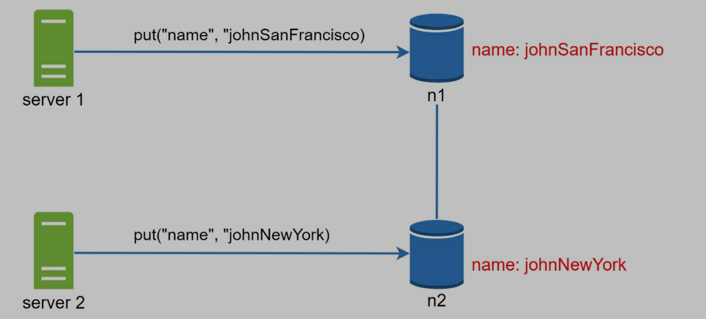
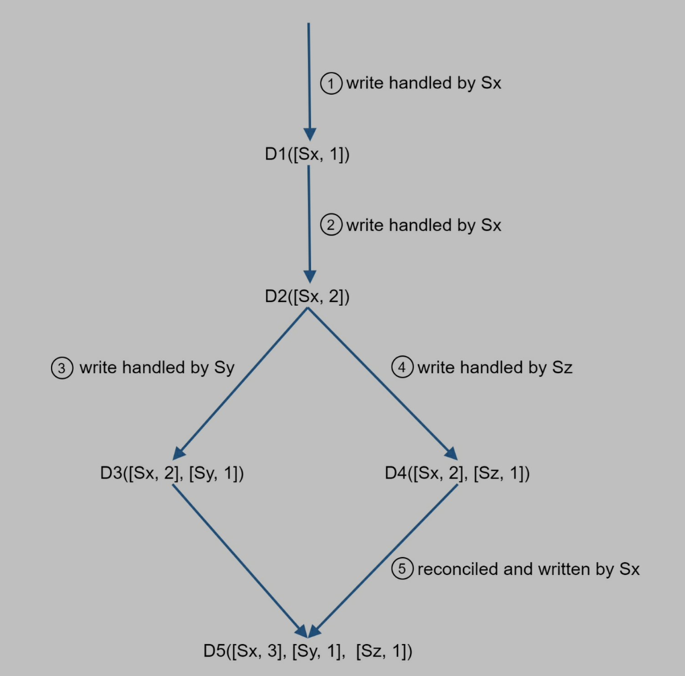
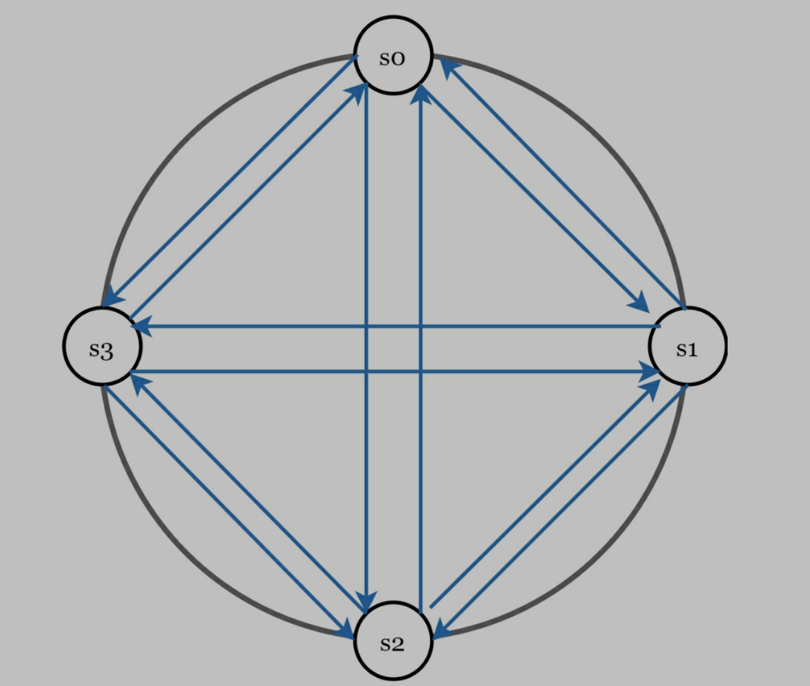
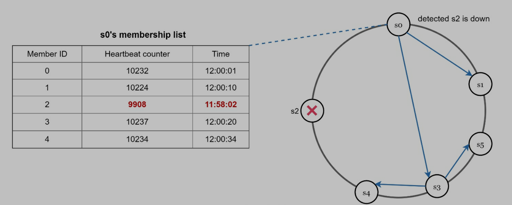

# Design a Key-value store

popular key-value store system

- Dynamo
- Cassandra
- BigTable

# Understand the problem and establish design scope

Design 通常面临的妥协

- read, write <-> memory usage
- consistency <-> availability

本文要实现的 key-value store

- The size of a key-value pair is small: less than 10 KB.
- Ability to store big data.
- High availability: The system responds quickly, even during failures.
- High scalability: The system can be scaled to support large data set.
- Automatic scaling: The addition/deletion of servers should be automatic based on traffic.
- Tunable consistency.
- Low latency.

## Single server key-value store

- store key-value pairs in a hash table
- in memory
- optimization
  - data compression
  - store only frequently used data in memory and the rest on disk

## distributed key-value store (distributed hash table)

每当设计 distributed system 的时候, 我们要考虑 CAP(consistency, availability, partition tolerance)

### CAP theorem

无法保证 CAP 中的三点同时满足

- consistency: data 在任何时候保持一致
- availability: 即使某些 server 坏了, 也能得到 response
- partition tolerance
  - partition: communication break between two nodes
  - partition tolerance: 即使 network partition, 系统仍然可以正常运行

CA 不可能实现, 因为无法保证不出现 network partition 的情况

- ideal situation
  - network partition 永远不发生
  - 数据写入 n1 会被自动备份到 n2 和 n3 (CA 满足)
- real-world distributed system
  - partition 无法避免
  - 当 partition 发生时, 我们必须在 C 和 A 中做出选择

如上图, n3 坏了, 不能和 n1, n2 沟通. 此时, 如果用户向 n1 或 n2 写入数据, n3 不会得到数据更新. 如果数据在 n3 坏了之前写到了 n3, 并且还没有更新到 n1 和 n2, 那么 n1 和 n2 就无法得到数据更新.

- 如果选择 consistency (CP)
  - 停止所有 write 操作在 n1 和 n2 以避免数据在 n1, n2, n3 中的 inconsistency
  - 造成 system unavailable
  - bank system 通常需要这样处理, 此时返回错误给用户, 直到问题得到处理
- 如果选择 availability (AP)
  - 系统接受 read 请求, 即使数据不一致
  - n1, n2 接受 write, 当系统恢复之后, 数据才传到 n3

# System components

## Data partition

问题: 数据太多, 必须 split data, 然后存入多个 servers 中.

两个挑战:

- distribute data evenly
- 减少 data movement 当添加或者减少 server 的时候

可以使用 consistent hashing 解决上述两个问题

## Data replication

To achieve high **availability and reliability**, data must be replicated asynchronously over N servers, where N is a configurable parameter.

- 当有一个 key 的时候, 顺时针旋转, 找到在环上的前 N 个 server 存入 data copy
- 前 N 个 server 可能存在 virtual node, 所以我们通常只选择前 N 个真实的 server
- 为了保证数据的可靠性, 通常把数据存在不同的 data center, 防止某个 data center 整个挂掉

## Consistency

Since data is replicated at multiple nodes, it must be synchronized across replicas.

- N, replicas 数量
- W, write quorum of size W, 只有至少当 W 个 replicas 承认全部 write, 操作才算成功
- R, read quorum of size R, 只有至少当 R 个 replicas 返回了 read 结果, 操作才算成功
- N, W, R 的选择通常是 consistency 和 latency 的妥协结果.
- 随着 W,R 增大, 数据的 consistency 更好, 但是速度会下降, 因为需要等待更多的 server 返回成功的信息

- 如上图, N = 3. 当 W = 1 时, 表示只要接受到 1 个 write 成功的信息, 就可以立即返回结果给 client, 不用等待三个全部返回成功的信息

## consistency models

A consistency model defines the degree of data consistency. 以下是常见的 model

- Strong consistency: 任何 read 操作都会得到最新的数据, 数据永远不会 out-of-date
  - 不接受 read/write 直到所有 replica 完成了更新
  - Not highly available 因为会阻断接下来的请求
- Weak consistency: 某些 read 可能无法得到最新的数据
- Eventual consistency: 一种特殊的 weak consistency, 在一定时间之后, 会得到最新的数据
  - Dynamo, Cassandra 采用这种模式
  - 在 concurrent writes 发生时, eventual consistency 采用 **reconciliation**的方法, 强制用户使数据统一

## inconsistency resolution: versioning

### inconsistency 如何发生的?

一开始, replica nodes n1, n2 具有相同的值. 随后, server1 改变了 name, server2 同时也改变了 name, 此时出现了 inconsistency.

- replication 可以得到 high availability, 但是造成 replica 之间的 inconsistency

### 如何解决 inconsistency?

versioning 和 vector clocks 通常用来解决 inconsistency problem

- versioning: 把 data modification 看做 immutable version of data
- vector clock: 使 data item 带有[server, version]

假设目前有 vector clock 表示为 D([s1, v1], [s2, v2], ..., [sn, vn]), 其中 D 是 data item, v1 是 version counter, s1 是 server number...

- 如果 data item D 被写入 server si, 系统需要执行下面中的一个任务
  - 增加 vi 如果[si, vi]存在
  - 创建 [si,1]

1. client 写入 data item D1, sx 处理请求, 此时有 vector clock D1[(sx, 1)]
2. 另一个 client 读取最新的 D1, 然后更新为 D2, 并写入, sx 处理请求. D2 覆盖了 D1, 此时有 D2([sx, 2])
3. 另一个 client 读取最新的 D2, 然后更新为 D3, 并写入, sy 处理请求. 此时有 D3([sx, 2], [sy, 1])
4. 另一个 client 读取最新的 D2, 然后更新为 D4, 并写入, sz 处理请求. 此时有 D3([sx, 2], [sz, 1])
5. 另一个 client 读取最新的 D3, D4, 发现了 conflict, 因为 D2 被 sy 和 sz 修改过. conflict 被 client 解决, 并更新数据到 server. 假设 sx 处理这个请求, 此时有 D5([sx, 3], [sy, 1], [sz, 1]).

vector clock 的优点

- 可以知道版本的先后, 比如 D([s0, 1], [s1, 1])在 D([s0, 1], [s1, 2])之前 (此时没有 conflict)
- 可以知道是否有 conflict, 比如 D([s0, 1], [s1, 2]) 和 D([s0, 2], [s1, 1])存在 conflict

vector clock 的缺点

- complexity: 需要让 client 处理 conflict, 并且需要实现 conflict resolution logic
- [server, version]的数量会快速增加: 可是设定一个阈值, 当数量增加到一定程度, 删除旧的记录

## handling failures

### failure detection

在分布式系统中, 通常有两个独立信息说某个 server 坏了的时候, 我们才确定这个 server 坏了.

#### 解决方案 1: all-to-all

可行但是低效

#### 解决方案 2: decentralized failure detection methods, 比如 gossip protocol

- 每个 node 存放一个 node list, 包括 id, heartbeat counters
- 每个 node 周期性增加 counter
- 每个 node 周期性发送 heartbeat 给一些随机的 node
- 当 node 收到 heartbeat, node list 被更新
- 如果 heartbeat counter 在一个周期内没有增加, 这个 node 被认为是坏了

如上图

- s0 保存一个 node list
- s0 发现 s2 的 heartbeat counter 很久没有增加了
- s0 发送 heartbeat 给一些随机的 node, 包括 s2. 其他 nodes 确认 s2 的 heartbeat 在他们的 list 中也很久没更新了. 此时, 我们标注 s2 坏了
- s2 坏了的信息被更新到其他的 node 上

### handle temporary failure

当 failure 被 gossip protocol 检测到之后, 系统需要做些什么以确保 availability

#### Sloppy quorum 方法

- 系统在 hash ring 上选择前 W 个健康的 server 进行写, 前 R 个健康的 server 进行读, 坏的 server 被忽略

hinter handoff 过程 - 处理 temporary failures

- 如果某个 server 坏了, 一个好的 server 会暂时处理这些请求.
- 当坏的 server 恢复了, 会更新期间的所有更改以达到 consistency

如上图, s2 坏了, s3 将会暂时除了 s2 的请求. 当 s2 恢复了, s3 会把数据传给 s2.

### handing permanent failures

问题: 如何处理 permanent failure?

#### anti-entropy protocol

- compare data on replicas
- update all replicas to new version
- Merkle (hash) tree:
  - A hash tree or Merkle tree is a tree in which every non-leaf node is labeled with the hash of the labels or values (in case of leaves) of its child nodes. Hash trees allow efficient and secure verification of the contents of large data structures
  - 检测 inconsistency detection
  - minimize the amount of data transferred.

假设 key space 是 1-12, 红色的 box 表示 inconsistency

1. divide key space into buckets (比如 4). 每个 bucket 是 root, 用来维持一定深度的 tree
2. buckets 创建后, hash 每个 key
3. 每个 bucket 创建一个 hash node
4. 通过计算 children 的 hash, 创建 tree
5. 比较两个 Merkle tree
   1. 先比较 root hash
   2. 然后比较 left, right
   3. 通过遍历 tree, 可以得到 bucket 的 consistency 状态
   4. 同步那些 inconsistency 的 bucket

### handle data center outage

起因

- power outage
- network outage
- natural disaster

解决

- replicate data across multiple data centers

# System architecture diagram

- client communicate with key-value store though simple API, like get, put
- coordinator node: 作为一个 proxy, 链接 client 和 key-value store
- 使用 consistent hashing 分布 node
- system is decentralized, 因此 add/move nodes 是自动的. 每个 node 都执行很多 tasks
- data is replicated in nodes
- no single point of failure

# Write path

1. write request 被永久保存在 commit log file
2. data is saved in memory cache
3. 当 cache 满了, 数据被放进 SSTables (sorted-string table, a file of key/value string pairs, sorted by keys)

# Read path

1. 是否 cache 中有数据
   1. 如果是, 就返回数据
   2. 如果不是, 进入 2
2. 检查 bloom filter (一种在 SSTable 中的高效查询方法)
3. bloom filter 检测出 SSTable 中是否有 key
4. SSTable 返回结果
5. 结果返回给 client

# 计数总结

