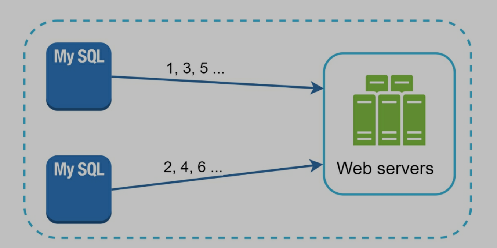
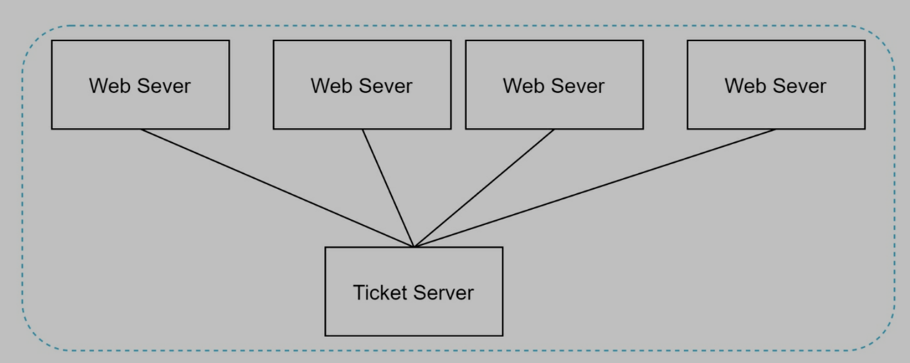
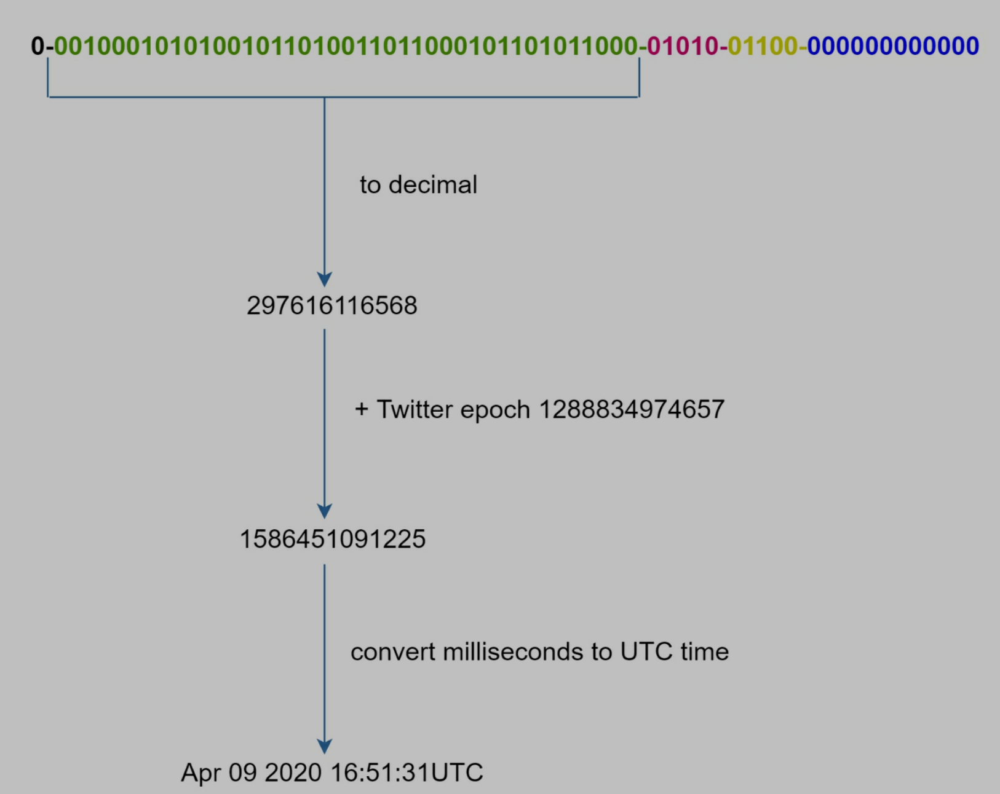

# Design a unique ID generator in distributed system

最简单的方法: 在 db 中使用 auto_increment, 但是不适用于分布式系统

- single db server is not large enough
- delay across multiple db

样例

# Step 1: Understand the problem and establish design scope

## 问答环节

- Candidate: What are the characteristics of unique IDs?
- Interviewer: IDs must be unique and sortable.
- Candidate: For each new record, does ID increment by 1?
- Interviewer: The ID increments by time but not necessarily only increments by 1. IDs created in the evening are larger than those created in the morning on the same day.
- Candidate: Do IDs only contain numerical values?
- Interviewer: Yes, that is correct.
- Candidate: What is the ID length requirement?
- Interviewer: IDs should fit into 64-bit.
- Candidate: What is the scale of the system?
- Interviewer: The system should be able to generate 10,000 IDs per second.

## 总结需求

- IDs must be unique.
- IDs are numerical values only.
- IDs fit into 64-bit.
- IDs are ordered by date.
- Ability to generate over 10,000 unique IDs per second.

# Step 2: Propose high-level design and get buy-in

以下为可能的实现方法

## multi-master replication

- 使用 db 的 auto_increment 方法
- 每次增加 k 而不是 1, k 是 db server 的数量
- 如上图, 因为有 2 个 server, 所以每次增加 2
- 缺点
  - hard to scale with multiple data centers
  - IDs don't go up with time across multiple servers
  - Does not scale well when a server is added or removed

## UUID

- UUID is a 128-bit number used to identify information in computer systems.
- UUID 很难出现 collusion, 几乎为不可能事件
- 举例: UUID: 09c93e62-50b4-468d-bf8a-c07e1040bfb2
- UUID 可以独立产生, 不需要 server 之间进行交互, 因此可以使用下图的设计
- 优点
  - simple
  - easy to scale
- 缺点
  - IDs 的长度必须是 128bit, 但是我们需要 64bit
  - IDs do not go up with time
  - IDs could be non-numeric

## Ticket Server

- centralized auto_increment in a single db server (ticket server)
- 优点
  - numeric IDs
  - easy to implement
  - for small to medium-scale app
- 缺点
  - single point of failure: ticket server 坏了, 系统崩溃. 虽然可以引入多个 ticket servers, 但是这样又需要考虑 data synchronization

## Twitter snowflake approach

> divide an ID into different sections, 比较好的解决方法

- sign bit
  - 1 bit
  - 永远是 0
  - 有可能未来会用到, 比如变成 signed/unsigned number
- timestamp
  - 41 bits
  - milliseconds
  - twitter snowflake default epoch: 1288834974657, 相当于 11/04/2010, 01:42:54 UTC
- datacenter ID
  - 5 bits
  - 可以区分 32 个 datacenters
  - 开始运行之前就已经确定
- machine ID
  - 5 bits
  - 可以区分 32 个 machine
  - 开始运行之前就已经确定
- sequence number
  - 12 bits
  - 在某个 machine/process 上, 每次生成一个 ID, 增加 1
  - reset to 0 every millisecond

当 generator 运行的时候, 只有 timestamp 和 sequence numbers 在生成

# Step 3: Design deep dive

## Timestamp

上图展示了如何把 41bits 的数字转化为时间

- As timestamps grow with time, IDs are sortable by time.
- 41 bits 可以显示的时间跨度是~69 年

## Sequence number

- 12 bits
- 可以得到 4096 个组合
- sequence number 是 0, 除非在 1 millisecond 的时间内, 在同一个 server 上, 产生了 2 个 ID
- 理论上讲, 一个 server 可以生成 4096 个 IDs/millisecond

# Step 4: wrap up

更进一步的讨论

- clock synchronization
  - 当前设计假设 servers 都有同样的 clock, 但是实际上 servers 可能运行在不同的地方
  - 解决方案: network time protocol
- section length tuning
  - 可以改变某些 section 的长度来优化系统
  - 增加 timestamp 的长度对 low concurrency, long-term app 更有效
- high availability
