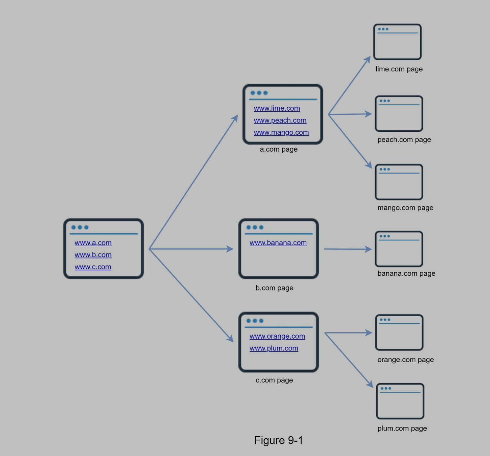
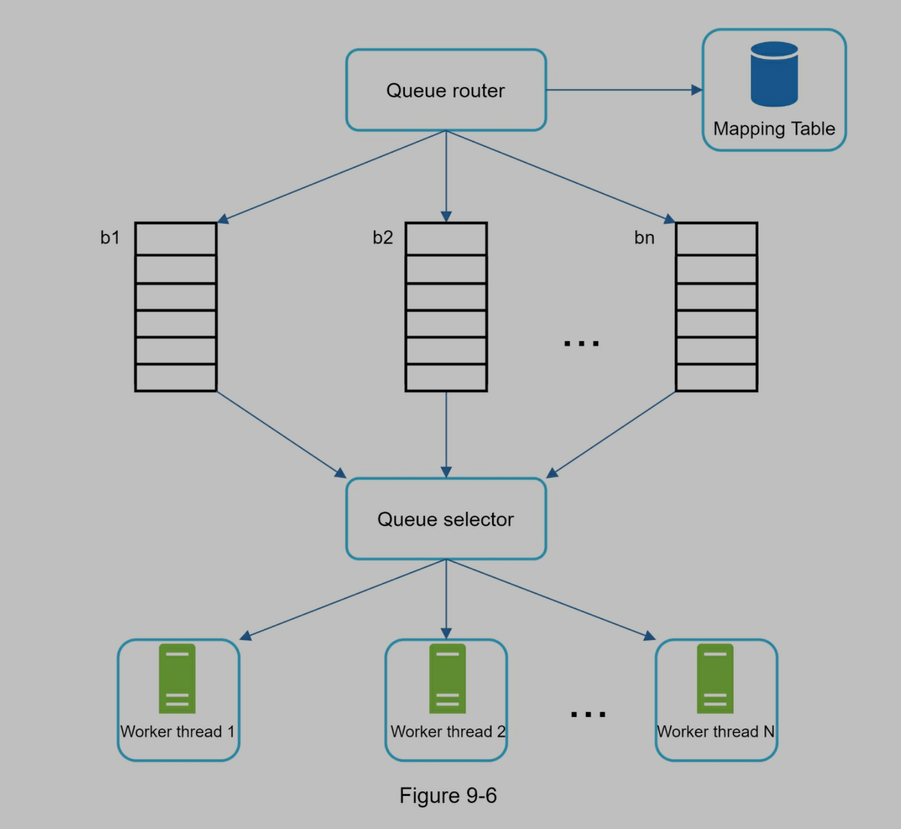
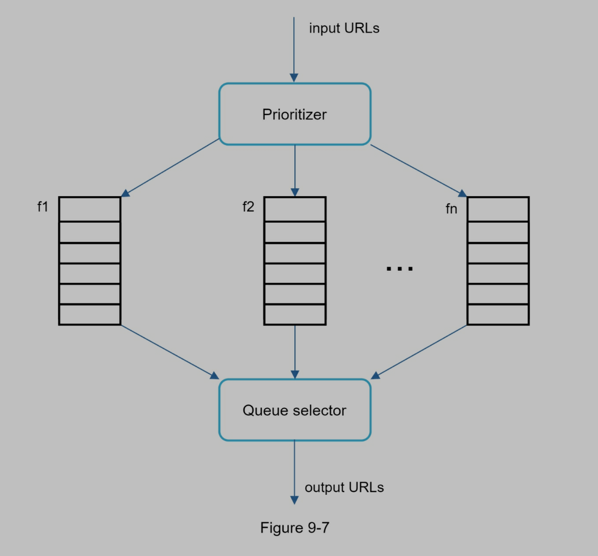
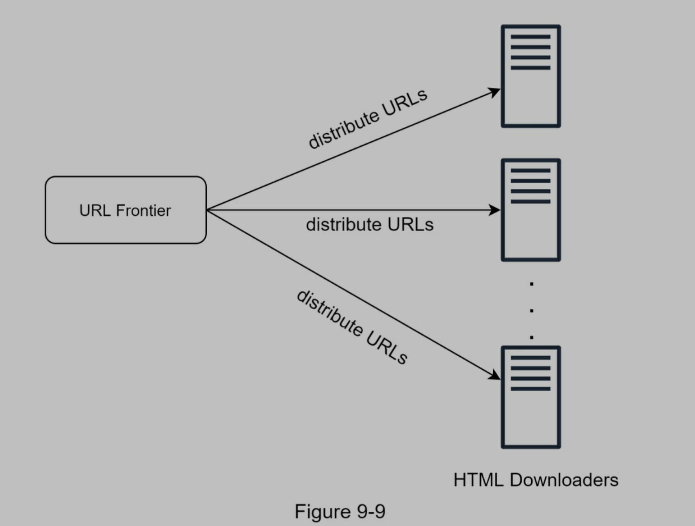

A web crawler is known as a robot or spider.



主要应用

- search engine indexing: 例如 Googlebot
- web archiving: 保存网页上的数据, 比如一些图书馆会使用 crawler
- web mining: data mining
- web monitoring

# Step 1 - Understand the problem and establish design scope

基本算法

1. 给定 URLs, 下载 web page
2. 提取 URLs 从下载的 web page 中
3. 把上一步得到的 URLs 加入到 URL list 中, 然后重复这三步

可能问的问题

- Candidate: What is the main purpose of the crawler? Is it used for search engine indexing, data mining, or something else?
- Interviewer: Search engine indexing.
- Candidate: How many web pages does the web crawler collect per month?
- Interviewer: 1 billion pages.
- Candidate: What content types are included? HTML only or other content types such as PDFs and images as well?
- Interviewer: HTML only.
- Candidate: Shall we consider newly added or edited web pages?
- Interviewer: Yes, we should consider the newly added or edited web pages.
- Candidate: Do we need to store HTML pages crawled from the web?
- Interviewer: Yes, up to 5 years
- Candidate: How do we handle web pages with duplicate content?
- Interviewer: Pages with duplicate content should be ignored.

还需要考虑的方面

- Scalability: 是否需要 parallelization.
- Robustness: 处理 edge cases.
- Politeness: 短时间内不应该对一个网站进行多次抓取
- Extensibility

## back-of-envelope estimation

- Assume 1 billion web pages are downloaded every month.
- QPS: 1,000,000,000 / 30 days / 24 hours / 3600 seconds = ~400 pages per second.
- Peak QPS = 2 \* QPS = 800
- Assume the average web page size is 500k.
- 1-billion-page x 500k = 500 TB storage per month.
- Assuming data are stored for five years, 500 TB \* 12 months \* 5 years = 30 PB. A 30 PB storage is needed to store five-year content.

# Step 2 - Propose high-level design and get buy-in


## Seed URLs

- seek URLs 是 starting point
- 可以选取 domain name

## URL Frontier

通常 crawl state 分成两类

- to be downloaded (URL Frontier 存储这些 URLs)
- already downloaded

## HTML downloader

根据 URL Frontier 下载 web pages

## DNS Resolver

HTML Downloader 使用 DNS Resolver 来得到 IP address

## content parser

因为 parse content 会让 crawl 变慢, 所以 download 和 parse 分开进行

## content seen?

research reveals that 29% of the web pages are duplicated contents.

可以通过比较 HTML 的内容来删除 duplicate

## content storage

- 大部分存在 disk
- popular 内容存在 memory

## URL extractor

parse, extract links from HTML


## URL filter

The URL filter excludes certain content types, file extensions, error links and URLs in “blacklisted” sites.

## URL seen?

算法, 查看是否当前的 URL 已经抓取过, 防止重复抓取

## URL storage

存储访问过的 URL

## Web crawler workflow


1. 加入 seed URLs 到 URL Frontier
2. HTML downloader 从 URL Frontier 获取 URL
3. downloader 从 DNS 拿的到 IP 并下载
4. Content parser 分析 html
5. 如果 html 有效, 传给 content seen?
6. content seen 查看是否 html 已经保存过了
   1. 如果已经保存过了, 放弃当前 html
   2. 如果没有, html 传给 link extractor
7. link extractor 提取 links
8. 提取的 links 传入 URL filter
9. 有效的 URL 传入 URL seen
10. URL seen 查看是否 URL 已经被处理过
    1. 如果是, 放弃当前 URL
    2. 如果不是, 传入 URL Frontier
11. 回到 1

# Step 3 - Design deep dive

## DFS VS BFS

You can think of the web as a directed graph where web pages serve as nodes and hyperlinks (URLs) as edges.

通常选用 BFS, 因为 web 通常深度太大, 不宜使用 DFS

使用 BFS 的两个问题

- 很多网站的 link 会只想主页, 这样会造成多次抓取主页, 这时 impolite 的
- 基本的 BFS 算法不考虑 URL 的优先级, 有些 URL 可能很重要, 有些可能不重要

## URL Frontier

URL Frontier 可以解决上述问题

- 存放 URLs
- 确保 politeness, URL prioritization, freshness
  - politeness
    - 不应该在短时间内抓取同一个网站
    - 可以加一个 delay 在两个 download 任务之间
    - The politeness constraint is implemented by maintain a mapping from website hostnames to download (worker) threads. Each downloader thread has a separate FIFO queue and only downloads URLs obtained from that queue. 
  - priority
    - 可以使用 PageRank, website traffic, update frequency 作为优先级的选择标准
  - freshness
    - page 总会更新, 因此需要定期下载
    - 可以根据 page 的 update history 选择是否需要 recrawl
    - 经常下载更新重要的页面
- Storage for URL Frontier
  - URL 非常多
  - 大部分存放在 disk
  - 在 memory 中维持一个 buffer, 存放一部分 URL, 这部分数据周期性的写入 disk

URL Frontier design

- Front queues: manage prioritization
- Back queues: manage politeness


## HTML downloader

### Robots.txt (Robots Exclusion Protocol)

standard used by websites to communicate with crawlers

```Robots.txt
User-agent: Googlebot
Disallow: /creatorhub/*
Disallow: /rss/people/*/reviews
Disallow: /gp/pdp/rss/*/reviews
Disallow: /gp/cdp/member-reviews/
Disallow: /gp/aw/cr/
...
```

- 指定了那些 pages 可以下载
- crawler 应给遵守 Robots.txt 中的 rules
- 可以 cache 这个文件, 避免重复下载

### Performance optimization

- distributed crawl
  
- cache DNS resolver
  - 通常 DNS request 是 synchronous 的, 因此会需要 10ms - 200ms 的时间
  - 可以使用 DNS cache 保存 URL 和 IP 的 map
- locality
  - 如果是在分布式系统中, 可以选择使用举例目标 page 近的 server 进行抓取
- Short timeout
  - 设置 maximal wait time

## Robustness

- consistent hashing
  - distribute loads among downloaders
  - a new downloader server can be added or removed using consistent hashing
- save crawl states and data to db
- exception handling
- data validation

## Extensibility


## Detect and avoid problematic content

- redundant content: 使用 hash 检查 duplication
- spider traps: a web page causes a crawler in an infinite loop
- data noise: 有些 page 只有广告

# Wrap up

- scalability
- politeness
- extensibility
- robustness

可能有的问题

- server-side rendering: https://developers.google.com/search/docs/guides/dynamic-rendering
- filter out unwanted pages: anti-spam component
- database replication and sharding
- horizontal scaling
- availability, consistency, and reliability
- analytics
