# Replication Controller

> How can you ensure there are at least 3 Pod instances (example) are always available and running at point in time?

## What is replication controller

确保当pod不能正常运行的时候，再启动一个新的pod

- Ensures that a specified number of pods are running at any time
    - If there are excess Pods, they get killed and vice versa
    - New Pods are launched when they get fail, get deleted or terminated
- Replication Controllers and Pods are associated with **labels**
    - label是pod的tag
- Creating a **rc** with count of 1 ensure that a pod is always available

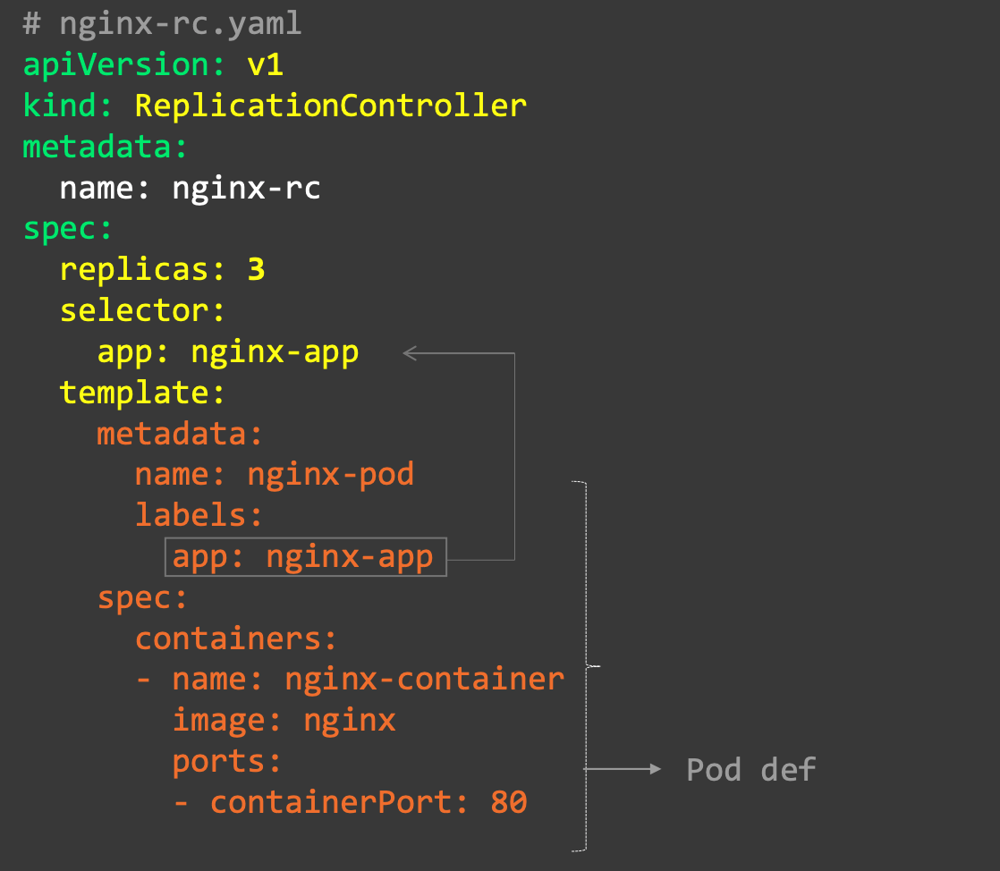

create

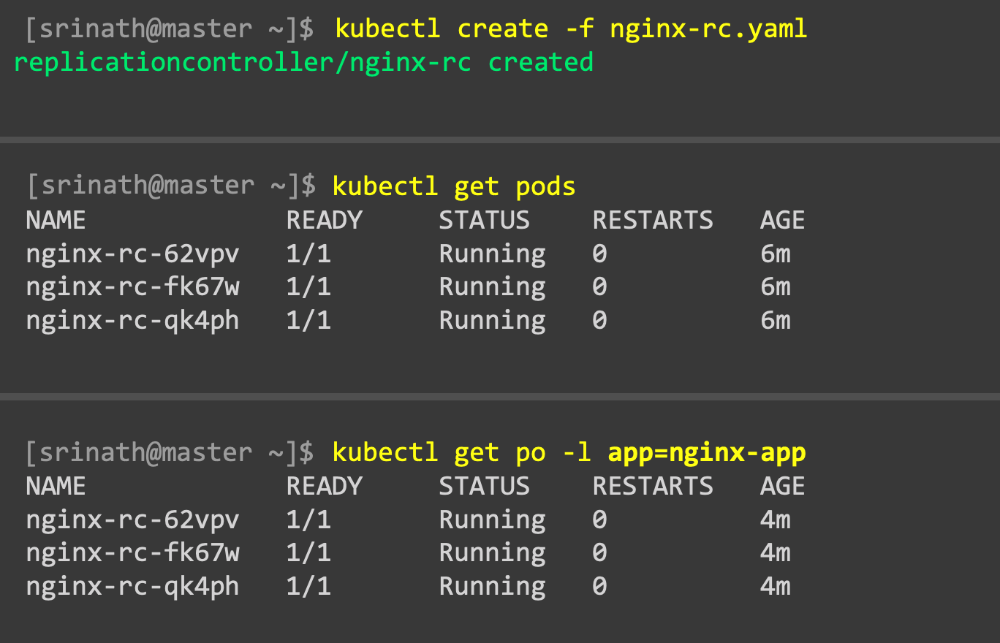


node fail
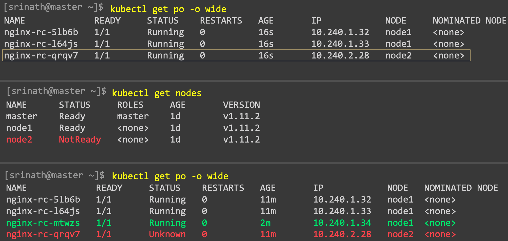

scale up
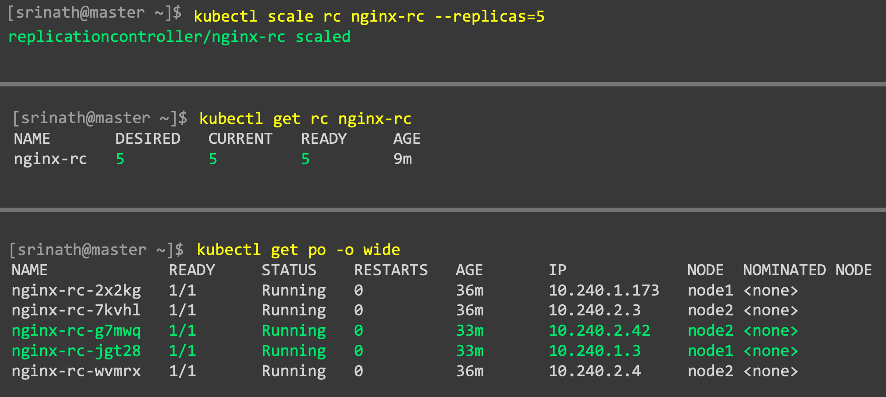

scale down


delete


## demo

nginx-rc.yaml

```yaml
apiVersion: v1
kind: ReplicationController
metadata:
  name: nginx-rc
spec:
  replicas: 3
  template:
    metadata:
      name: nginx-pod
      labels:
        app: nginx-app
    spec:
      containers:
        - name: nginx-container
          image: nginx
          ports:
            - containerPort: 80
  selector:
    app: nginx-app
```

```bash
# 创建
kubectl create -f nginx-rc.yaml
# 查看
kubectl get po -o wide
# 只显示特定label的pod
kubectl get po -l app=nginx-app
kubectl get rc nginx-rc
kubectl describe rc nginx-rc

kubectl get po -o wide --watch
kubectl get po -o wide
kubectl get nodes
# how to shut down a worker node
# go to the worker node terminal and type
shutdown

kubectl scale rc nginx-rc --replicas=5
kubectl get rc nginx-rc
kubectl get po -o wide

kubectl scale rc nginx-rc --replicas=3
kubectl get rc nginx-rc
kubectl get po -o wide

# 删除rc的同时，它创建的pod也会被删除
kubectl delete -f nginx-rc.yaml
kubectl get rc
kubectl get po -l app=nginx-app
```

# ReplicaSet

- Ensures that a specified number of pods are running at any time
    - If there are excess Pods, they get killed and vice versa
    - New Pods are launched when they get fail, get deleted or terminated
- ReplicaSet and Pods are associated with **labels**

## replicateSet vs replication controller

replicateSet is next-generation replication controller

- replicateSet - set-based selectors
- replication controller - equality-based selectors

## label and selector


- label: 使用key-value标记一个pod
- selectors: controllers/services选择然后控制pod

两种selector

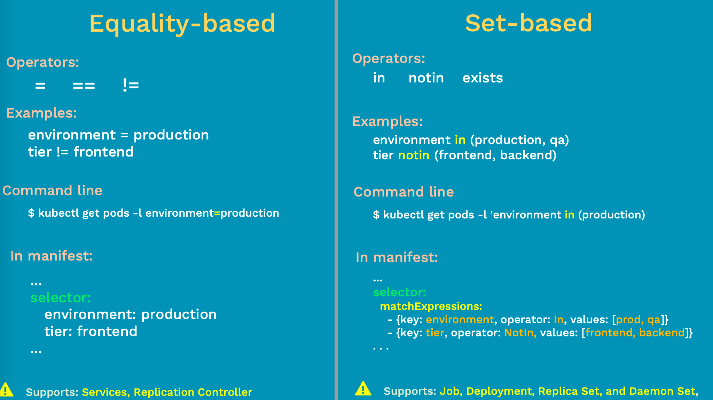

environment=production: 选择那些environment等于production的pods environment in (production, qa):
选择那些environment是production或者qa的pods


## Demo

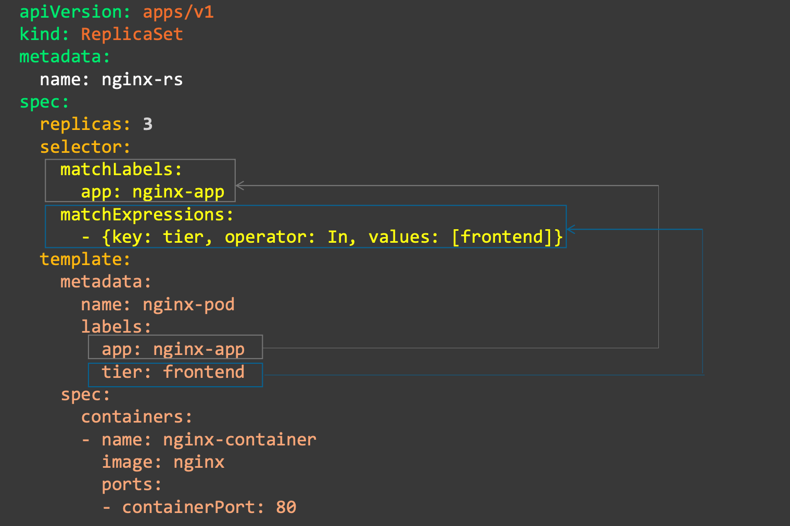


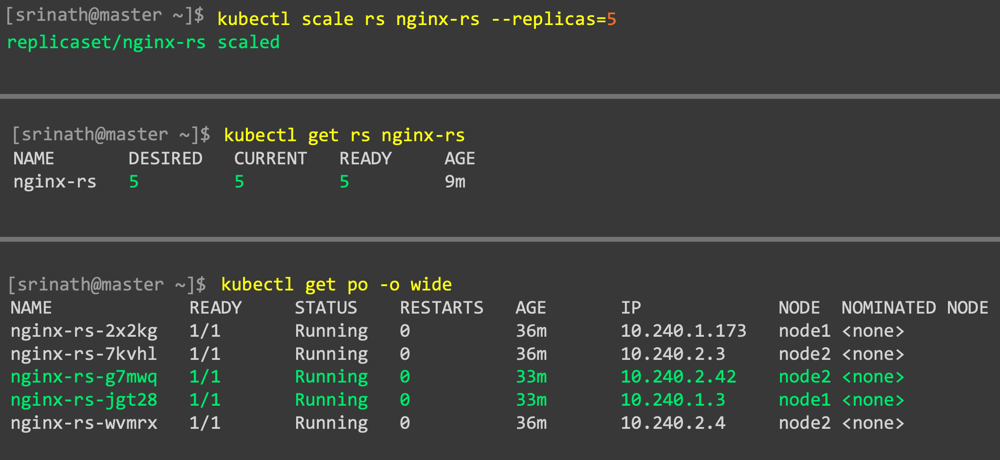
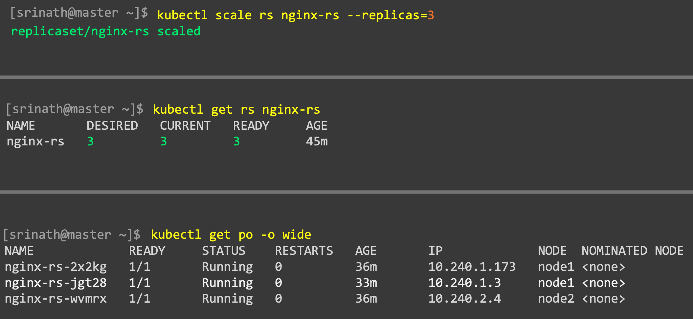


nginx-rs.yaml

```yaml
apiVersion: apps/v1
kind: ReplicaSet
metadata:
  name: nginx-rs
spec:
  replicas: 3
  template:
    metadata:
      name: nginx-pod
      labels:
        app: nginx-app
        tier: frontend
    spec:
      containers:
        - name: nginx-container
          image: nginx
          ports:
            - containerPort: 80
  selector:
    matchLabels:
      app: nginx-app
    matchExpressions:
      - { key: tier, operator: In, values: [ frontend ] }
```

```bash
kubectl create -f nginx-rs.yaml
kubectl get po -o wide
kubectl get po -l app=nginx-app
kubectl get rs nginx-rs -o wide
kubectl describe rs nginx-rs

kubectl get po -o wide --watch
kubectl get po -o wide
kubectl get nodes

kubectl scale rs nginx-rs --replicas=5
kubectl get rs nginx-rs -o wide
kubectl get po -o wide

kubectl scale rs nginx-rs --replicas=3
kubectl get rs nginx-rs -o wide
kubectl get po -o wide

kubectl delete -f nginx-rs.yaml
kubectl get rs
kubectl get po -l app=nginx-app
```

# Deployment

Imagine, you are upgrading application from v1 to v2

- Upgrade with zero downtime?
- Upgrade sequentially, one after the other?
- Pause and resume upgrade process?
- Rollback upgrade to previous stable release

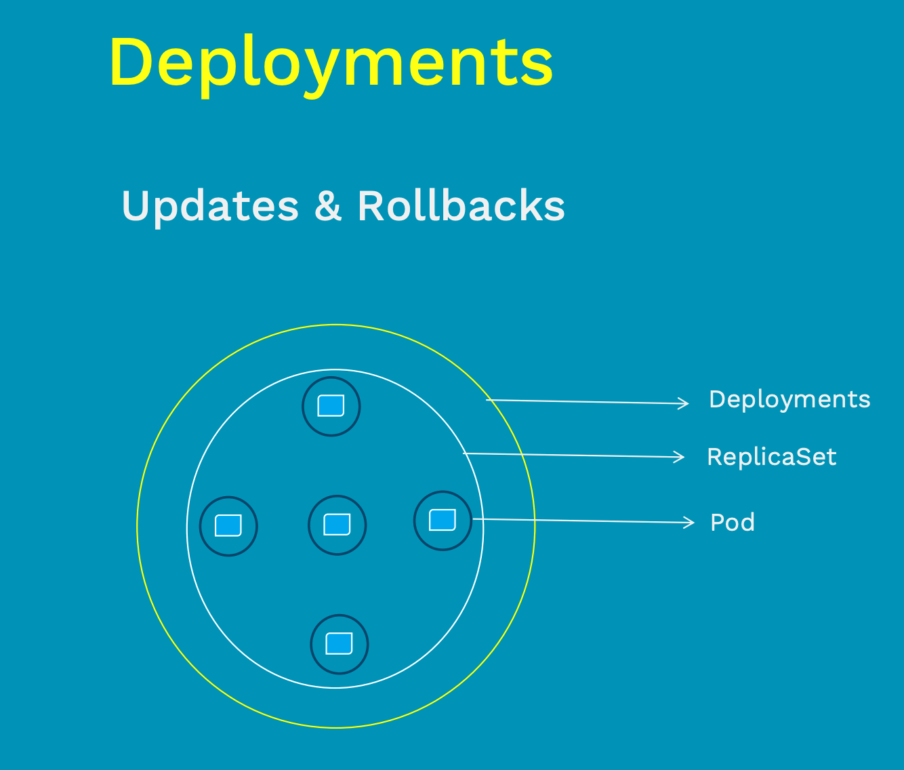

## 使用deployment

- replicas: k8s会自动创建replication机制，默认创建1个pod
- upgrade
- rollback
- scale up/down
- pause and resume

## deployment types

- Recreate
    - 关掉v1然后部署v2
    - 有downtime
    - 设置简单
- RollingUpdate (Ramped or Incremental) - k8s默认方式
    - 部署v2然后关掉v1
    - 使用简单
    - 耗时
- Canary
    - 使用v2代替一小部分v1，然后进行测试，测试成功后再全部变成v2
- Blue/Green
    - Blue: v1; Green: v2
    - 创建同样数量的v2进行测试，但是traffic仍然再v1
    - 容易rollback

create
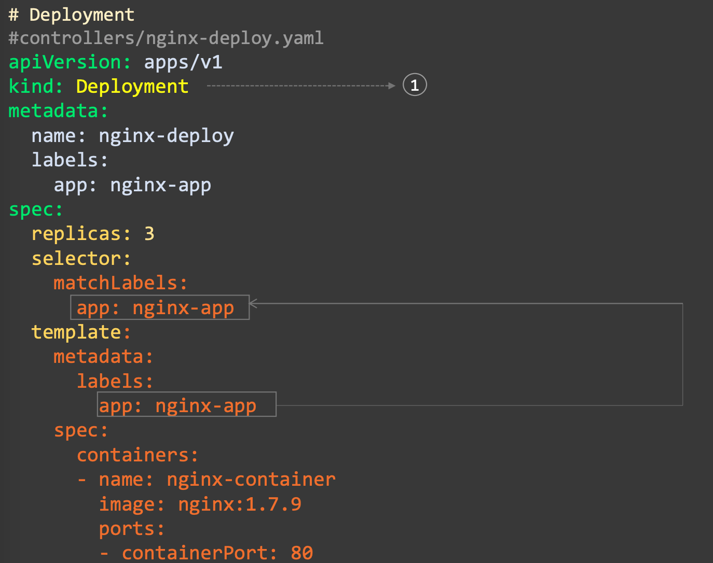

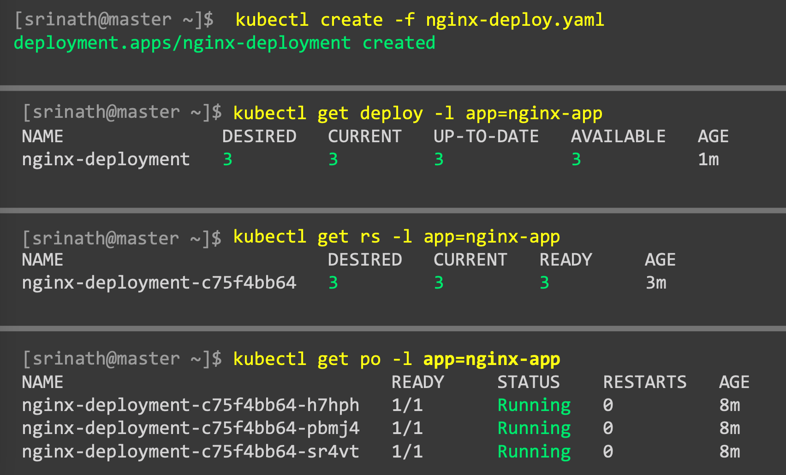

upgrade

使用set或者edit

edit会打开一个编辑器让你更改yaml文件，保存关闭后k8d会自动重新部署

可以使用kubectl rollout status查看状态

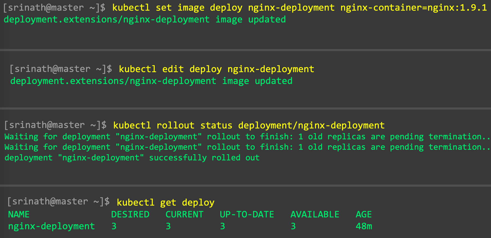

rollback

假设不小心使用了nginx:1.91(应该是1.9.1)

可以使用--record记录下每个命令以便之后查询

此时虽然显示deploy updated，但是其实并没有

使用kubectl rollout history发现错误，然后使用kubectl rollout undo进行rollout

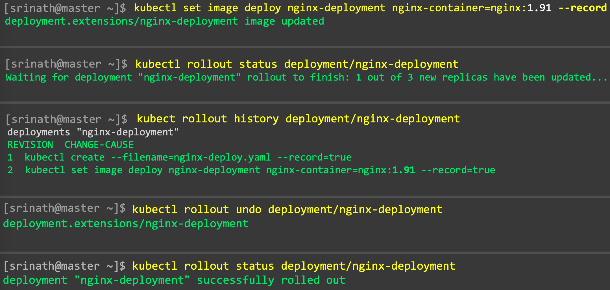

scale up/down
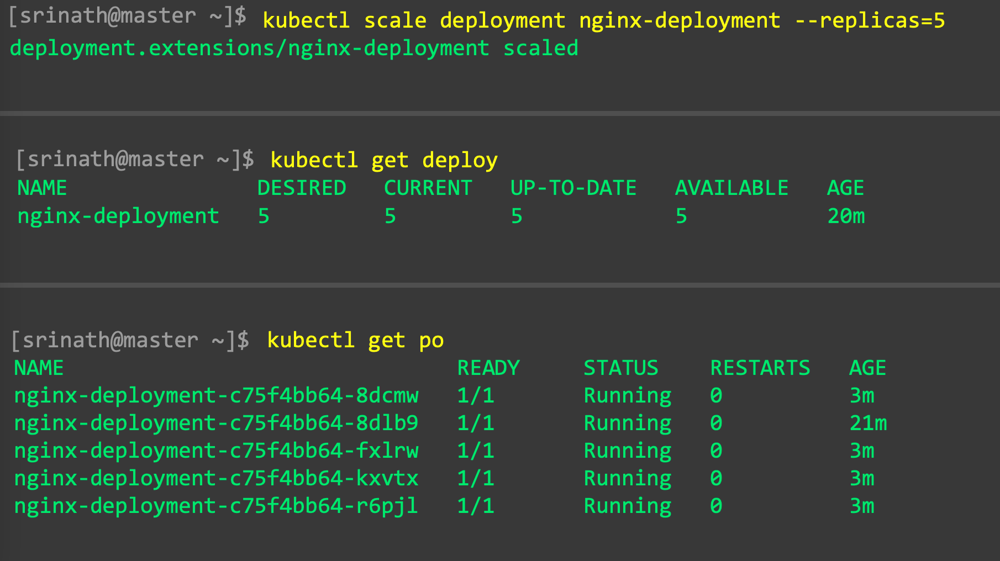
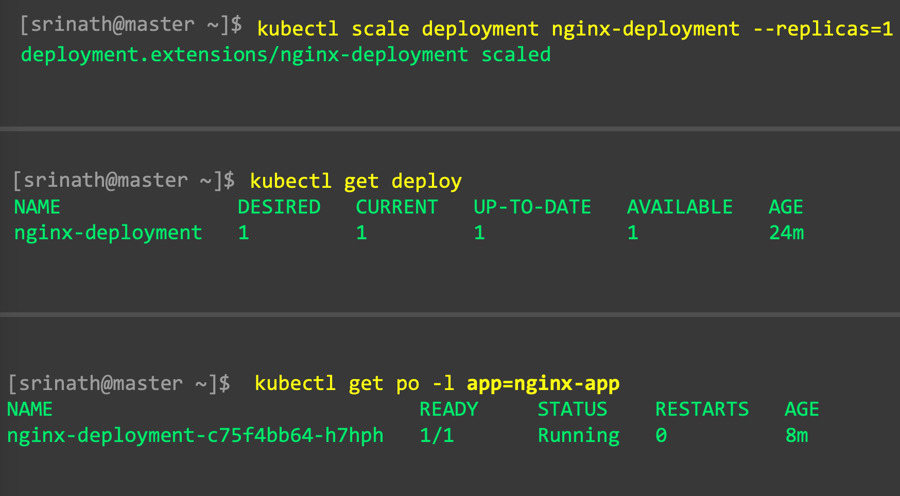
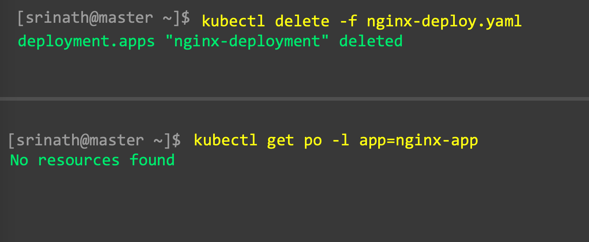

## Demo

nginx-deploy.yaml

```yaml
apiVersion: apps/v1
kind: Deployment
metadata:
  name: nginx-deploy
  labels:
    app: nginx-app
spec:
  replicas: 3
  template:
    metadata:
      labels:
        app: nginx-app
    spec:
      containers:
        - name: nginx-container
          image: nginx:1.7.9
          ports:
            - containerPort: 80
  selector:
    matchLabels:
      app: nginx-app
```

```bash
kubectl create -f nginx-deploy.yaml 
kubectl get deploy -l app=nginx-app
kubectl get rs -l app=nginx-app
kubectl get po -l app=nginx-app
kubectl describe deploy nginx-deploy

# upgrade / rollback
kubectl set image deploy nginx-deploy nginx-container=nginx:1.91 --record
kubectl rollout status deployment/nginx-deploy
kubectl rollout history deployment/nginx-deploy
kubectl rollout undo deployment/nginx-deploy
kubectl rollout status deployment/nginx-deploy
kubectl describe deploy nginx-deploy | grep -i image

# 方法1
kubectl set image deploy nginx-deploy nginx-container=nginx:1.9.1
# 方法2
kubectl edit deploy nginx-deploy # 打开编辑器
kubectl rollout status deployment/nginx-deploy
kubectl get deploy

kubectl scale deployment nginx-deploy --replicas=5
kubectl get deploy
kubectl get po -o wide

kubectl scale deployment nginx-deploy --replicas=3
kubectl get deploy
kubectl get po -o wide

# 将会删除pod和replicas
kubectl delete -f nginx-deploy.yaml
kubectl get deploy
kubectl get rs
kubectl get po 
```

# DaemonSet

> How do you deploy only one pod on every node or subset of nodes inside cluster?

## What is DaemonSet

- A DaemonSet ensures that all (or some) Nodes run a copy of a Pod.
- As nodes are added to the cluster, Pods are added
- As nodes are removed from the cluster, those Pods are garbage collected
- Deleting a DaemonSet will clean up the Pods it created

## Use cases

- Node monitoring daemons: Ex: collectd
- Log collection daemons: Ex: fluentd
- Storage daemons: Ex: ceph

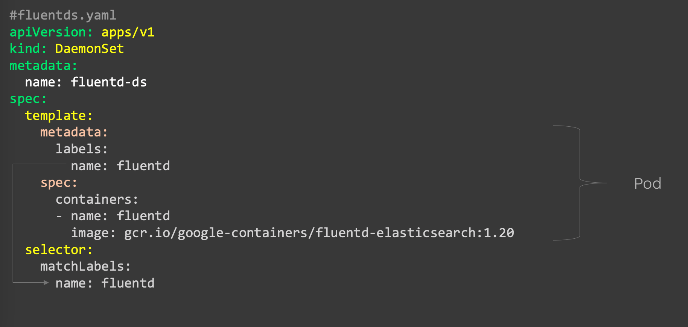
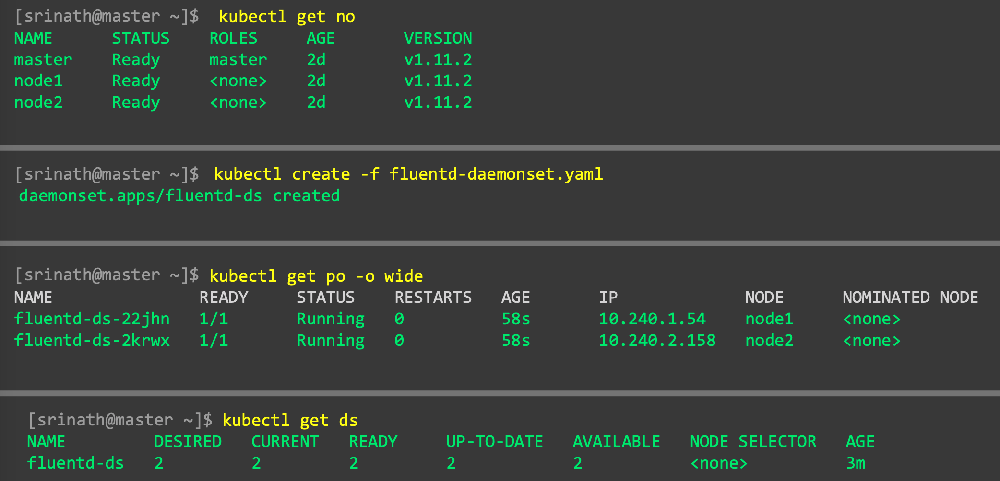
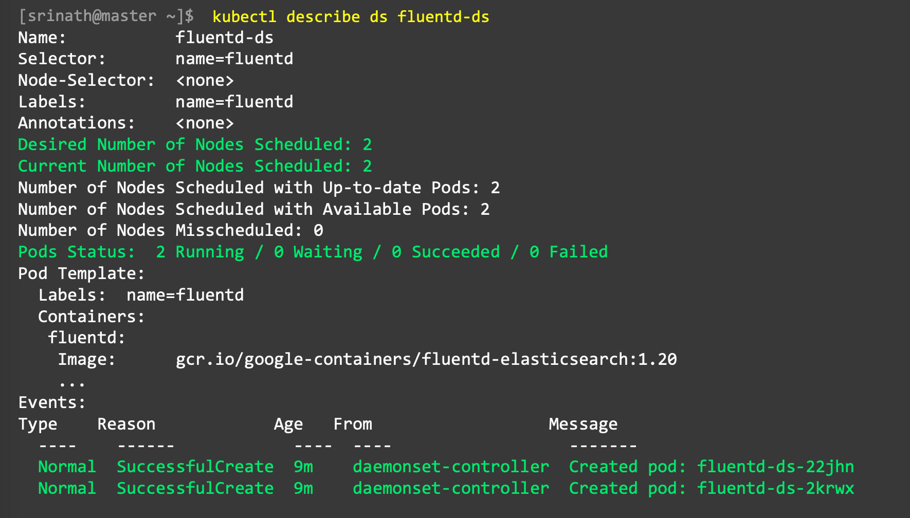


## Demo

### Deploy Pod on "all" worker nodes inside k8s cluster using DaemonSet

fluentd-ds-allnodes.yaml

```yaml
apiVersion: apps/v1
kind: DaemonSet
metadata:
  name: fluentd-ds
spec:
  template:
    metadata:
      labels:
        name: fluentd
    spec:
      containers:
        - name: fluentd
          image: gcr.io/google-containers/fluentd-elasticsearch:1.20
  selector:
    matchLabels:
      name: fluentd
```

```bash
kubectl create -f fluentd-ds-allnodes.yaml
kubectl get po -o wide
kubectl get ds
kubectl describe ds fluentd-ds
```

### Deploy Pod on "Subset" of worker nodes inside k8s cluster using DaemonSet

nginx-ds-subsetnodes.yaml

```yaml
apiVersion: apps/v1
kind: DaemonSet
metadata:
  name: nginx-ds
spec:
  template:
    metadata:
      labels:
        name: nginx
    spec:
      containers:
        - name: nginx-container
          image: nginx
      nodeSelector: # 只对某些node使用
        disktype: ssd
  selector:
    matchLabels:
      name: nginx
```

```bash
# Attach label to the nodes
kubectl get nodes
kubectl label nodes worker1 worker2 disktype=ssd
kubectl get nodes --show-labels
# 删除label
# kubectl label nodes worker1 worker2 disktype-
kubectl create -f nginx-daemonset.yaml
kubectl get po -o wide
kubectl get ds
kubectl describe ds nginx-ds
# delete
kubectl delete ds fluentd-ds
kubectl delete ds nginx-ds
kubectl get ds
kubectl get po # 同时会删除pod
```

# Jobs

How do you run Pods

- at scheduled times?
- till task completion?

## Job types

### Run to completion (Jobs)

- batch processing
- job结束后会删除
- each job creates one or more pods
- ensure they are successfully terminated
- job controller restarts or rescheduled if a pod or node fails during execution
- Can run multiple pods in parallel
- Can scale up using kubectl scale command

use cases

- One time initialization of resources such as Databases
- Multiple workers to process messages in queue (producer - consumer)

### Scheduled (CronJob)

- 某个时间运行

## Demo

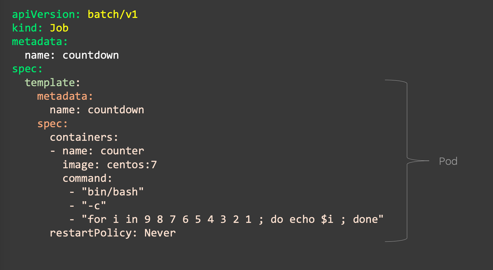
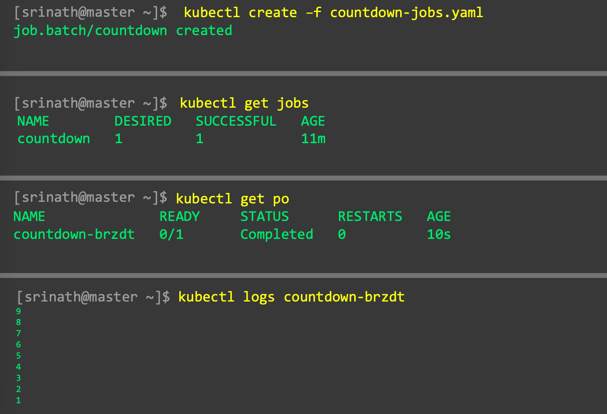
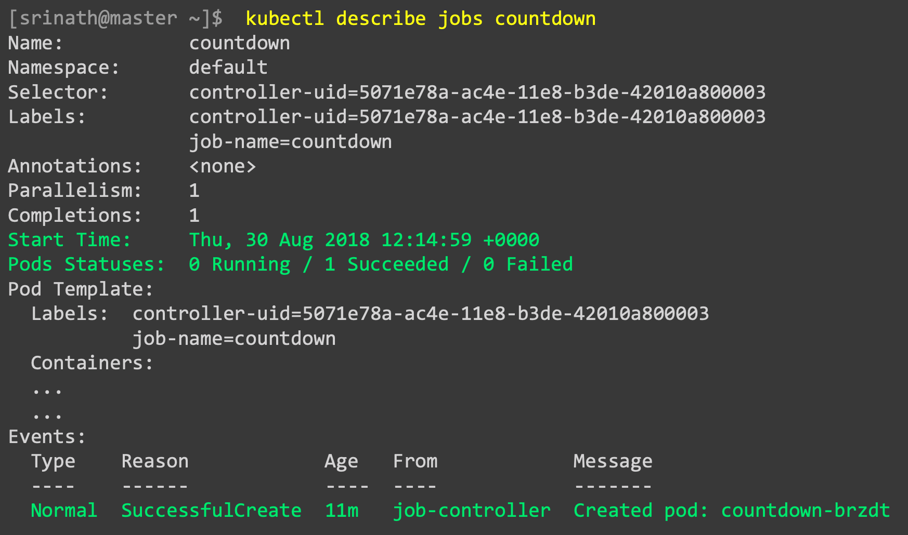
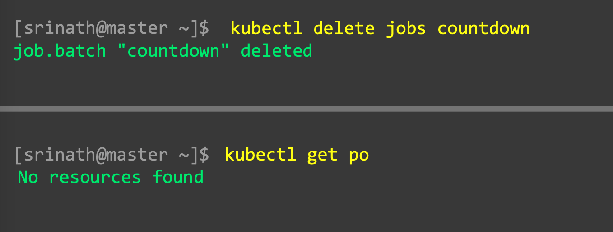

countdown-jobs.yaml

```yaml
apiVersion: batch/v1
kind: Job
metadata:
  name: countdown
spec:
  template:
    metadata:
      name: countdown
    spec:
      containers:
        - name: counter
          image: centos:7
          command:
            - "bin/bash"
            - "-c"
            - "for i in 9 8 7 6 5 4 3 2 1 ; do echo $i ; done"
      restartPolicy: Never
```

```bash
kubectl create -f countdown-jobs.yaml
kubectl get jobs
kubectl get po
kubectl describe jobs countdown

# 查看job运行记录
kubectl logs [POD_NAME] 

kubectl delete jobs countdown
kubectl get po
```