# Services

Imagine that, you have been asked to deploy web app

- How does this front end web app is exposed to outside world?
- How do front end web app is connected to backend database?
- How do we resolve Pod IP changes, when they die?

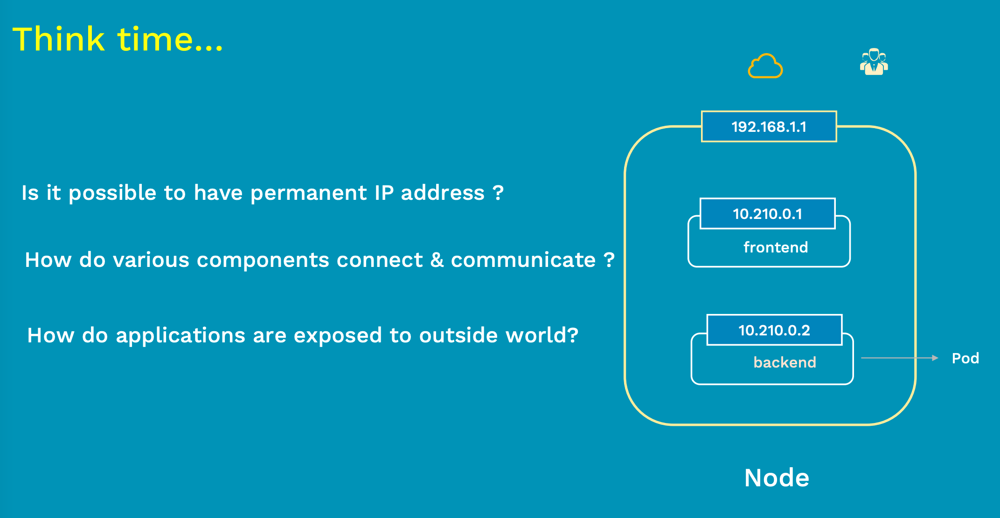

- node内部的pod如何通讯？
- 不同的service之间如何通讯？
- 如何把app暴露给外部？

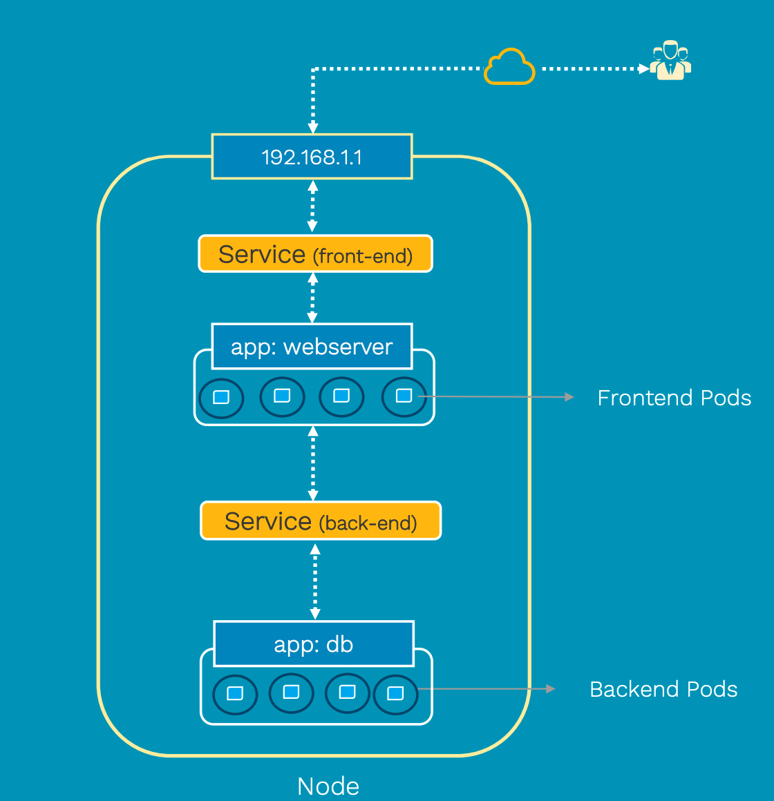

- front-end service 可以暴露给外部
- back-end service 不能暴露给外部，但是内部可以链接
- 使用label进行分组

service 把运行的pods分成组

## Types


- NodePort
    - 暴露给外部
- ClusterIP
    - 在node内部
    - 例如链接前端和后端
- LoadBalancer

# NodePort

> Imagine that, you have deployed your web app on to Kubernetes cluster.
> Now, you need to expose it outside world on the internet?


- 不能直接使用pod的IP，因为pod每次创建IP都会变化


- 创建NodePort Service可以得到静态的NodeIP和NodePort
- 用户可以通过NodeIP和NodePort来访问网站
- NodePort的范围只能是30000 - 32767, 如果不指定，k8s会自动分配一个

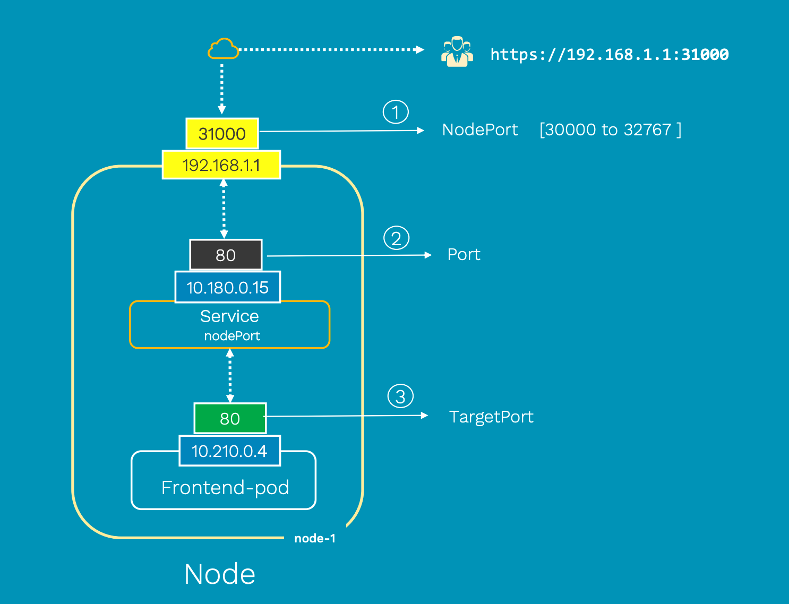

三个port

- NodePort: 外部访问时使用 30000 - 32767
- Port: Service自己的port
- TargetPort: container的port, 通常情况下Port和TargetPort一样

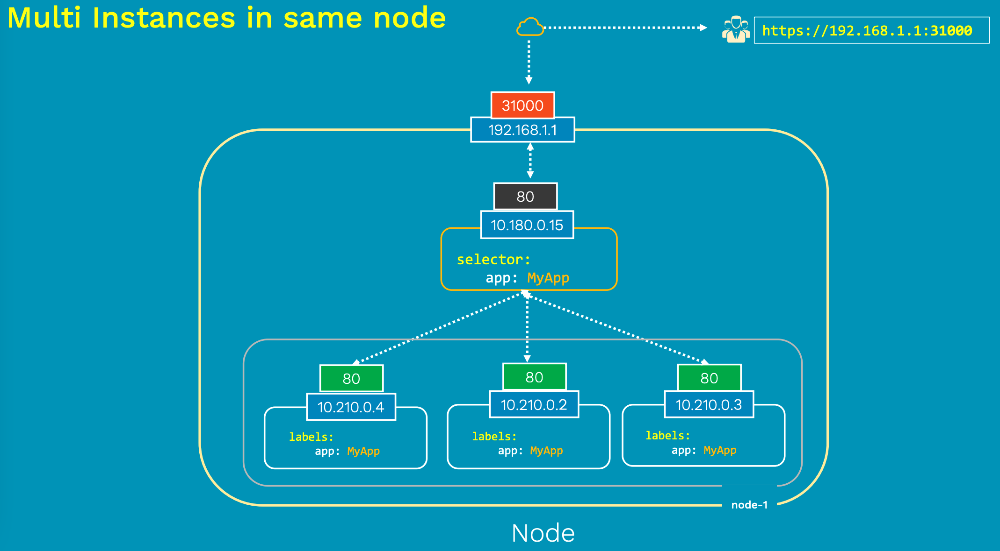

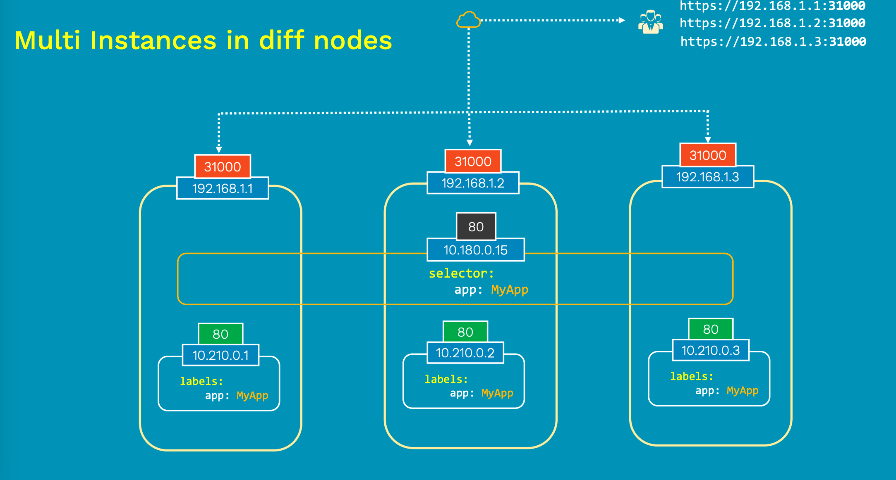

## 缺点

并不适合用在production

- You can only have once service per port
- You can only use ports 30000–32767
- If your Node/VM IP address change, you need to deal with that

## Demo

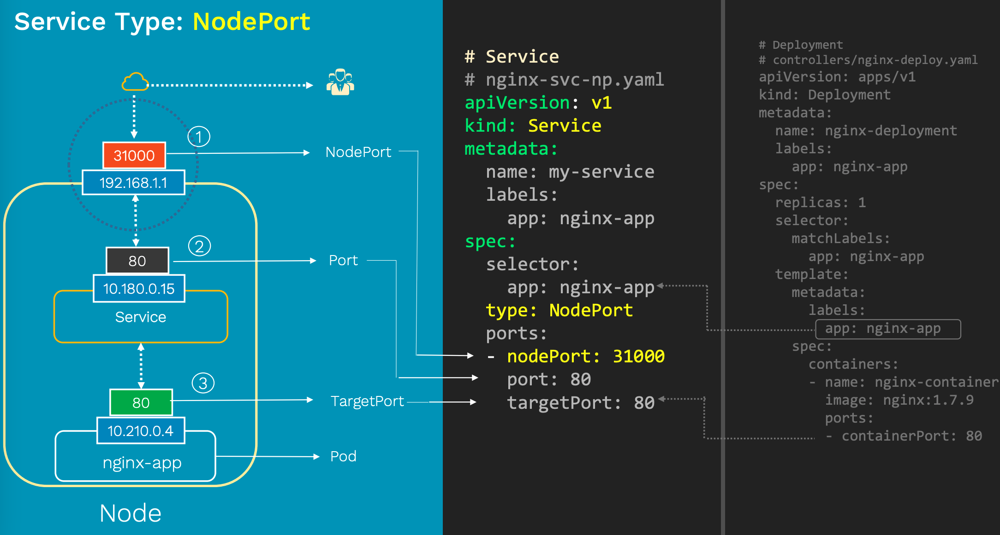
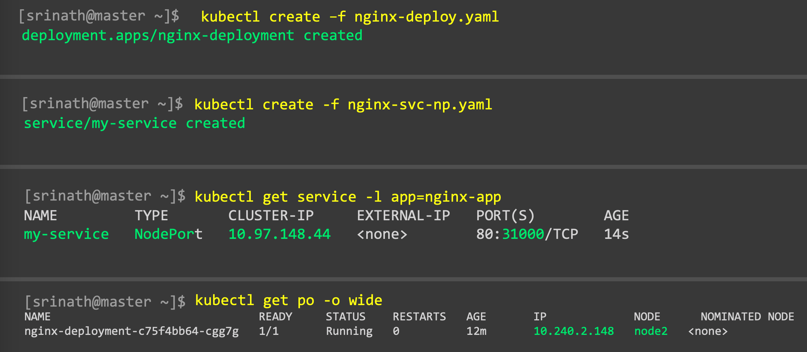


IP and Ports
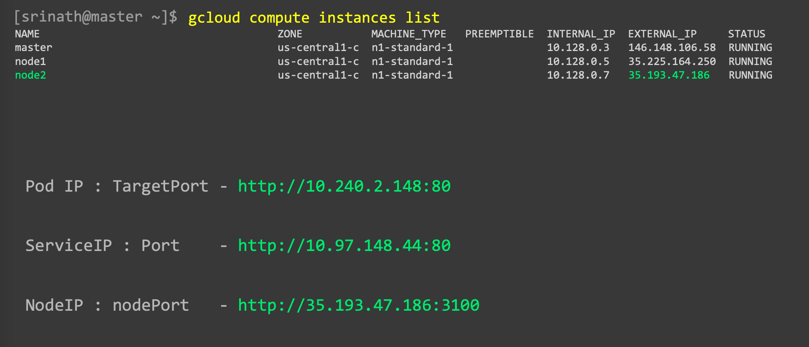

Access using Pod IP
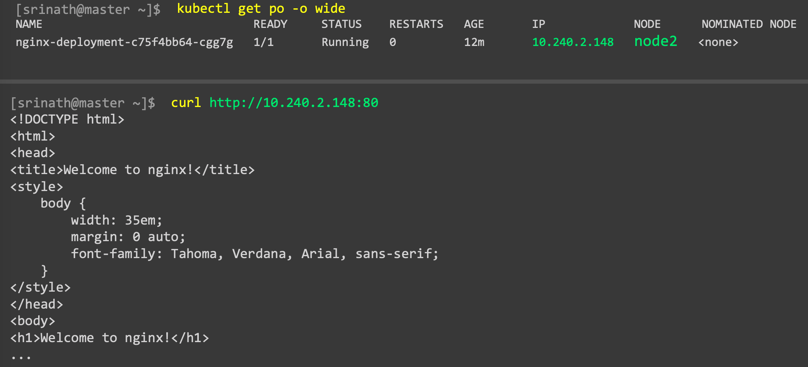

Access using Service IP
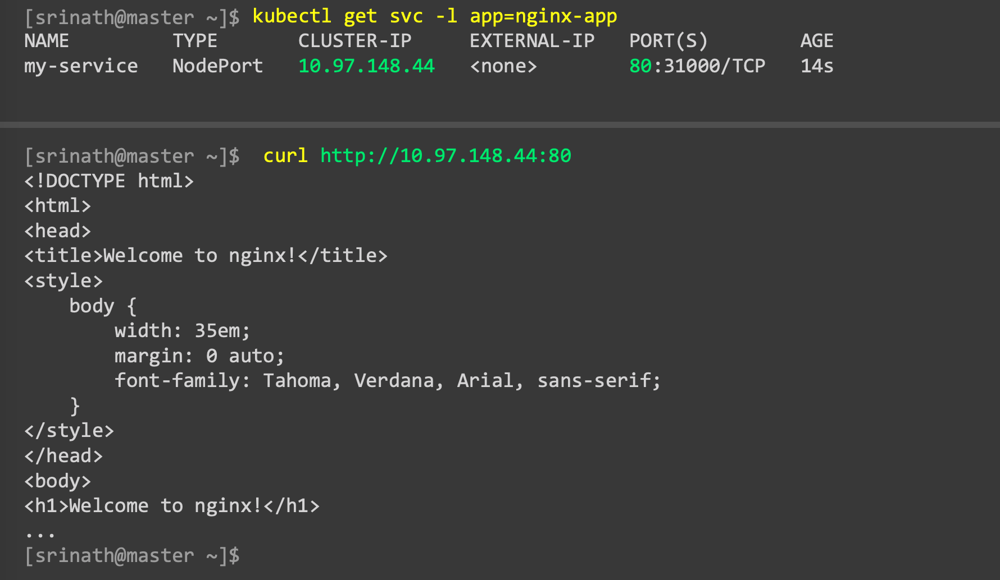

Access using Node IP (external IP)


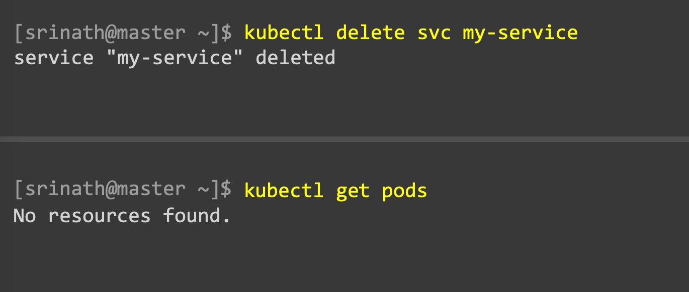

nginx-deploy.yaml

```yaml
apiVersion: apps/v1
kind: Deployment
metadata:
  name: nginx-deployment
  labels:
    app: nginx-app
spec:
  replicas: 1
  selector:
    matchLabels:
      app: nginx-app
  template:
    metadata:
      labels:
        app: nginx-app
    spec:
      containers:
        - name: nginx-container
          image: nginx:1.7.9
          ports:
            - containerPort: 80
```

nginx-svc-np.yaml

```yaml
apiVersion: v1
kind: Service
metadata:
  name: my-service
  labels:
    app: nginx-app
spec:
  selector:
    app: nginx-app
  type: NodePort
  ports:
    - nodePort: 31111
      port: 80
      targetPort: 80
```

```bash
kubectl create ñf nginx-deploy.yaml
kubectl create -f nginx-svc.yaml
kubectl get service -l app=nginx-app
kubectl get po -o wide
kubectl describe svc my-service

# To get inside the pod
kubectl exec [POD-IP] -it /bin/sh

# Create test HTML page in nginx
cat <<EOF > /usr/share/nginx/html/test.html
<!DOCTYPE html>
<html>
<head>
<title>Testing..</title>
</head>
<body>
<h1 style="color:rgb(90,70,250);">Hello, NodePort Service...!</h1>
<h2>Congratulations, you passed :-) </h2>
</body>
</html>
EOF

# Test using Pod IP:
kubectl get po -o wide
# 在master node中运行下边命令
curl http://[POD-IP]/test.html

#Test using Service IP:
kubectl get svc -l app=nginx-app
curl http://[cluster-ip]/test.html

#Test using Node IP (external IP)
#使用任何node IP都可以访问到
http://nodep-ip:nodePort/test.html
note: node-ip is the external ip address of a node.

kubectl delete -f nginx-deploy.yaml
kubectl delete -f nginx-svc.yaml
kubectl get deploy
kubectl get svc
kubectl get pods
```

# Load Balancer

> Imagine that, using nodePort service type you exposed your web app to outside world on the internet

which node IP and nodePort will you provide to end users?

可以使用任何node IP去访问，那应该使用哪个给用户呢？
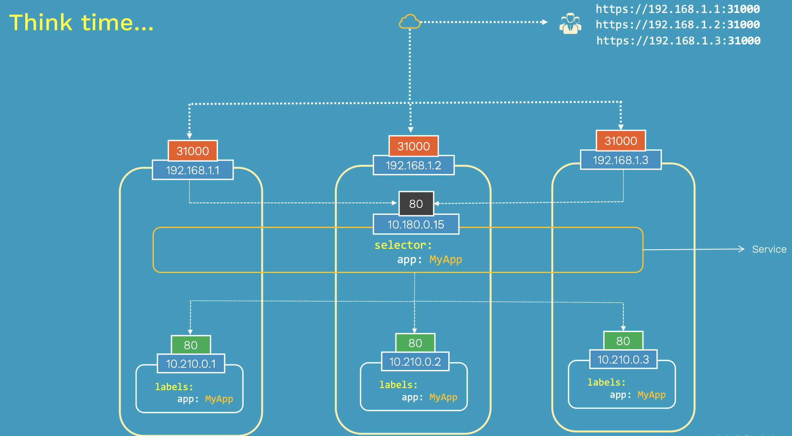


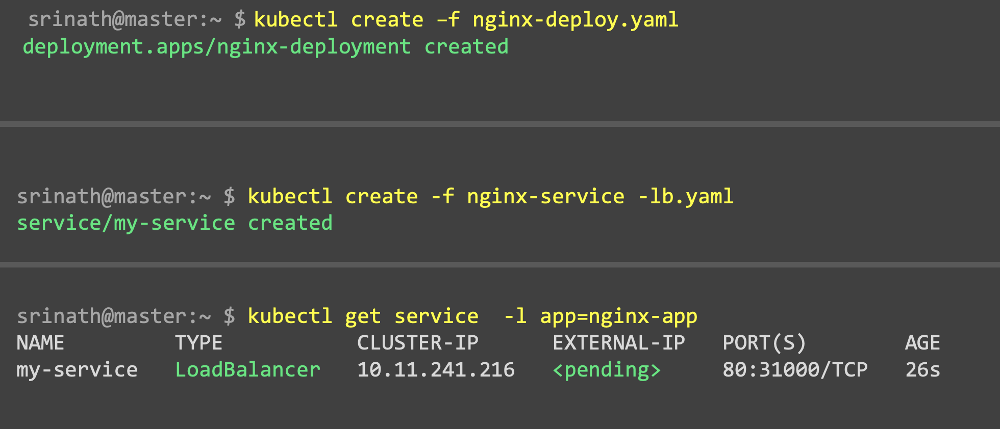


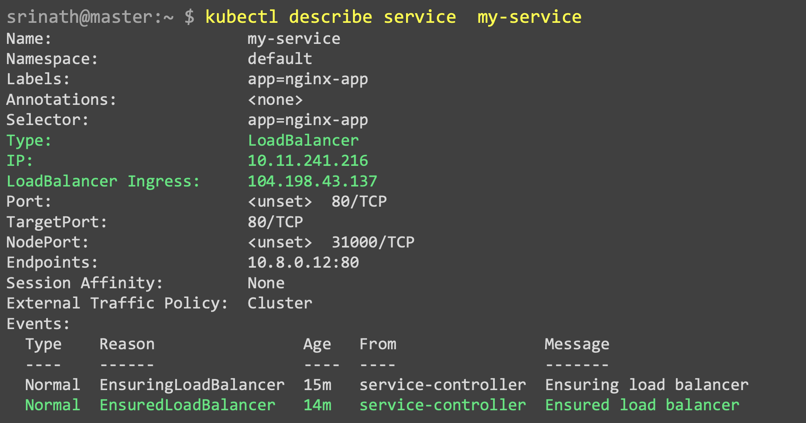

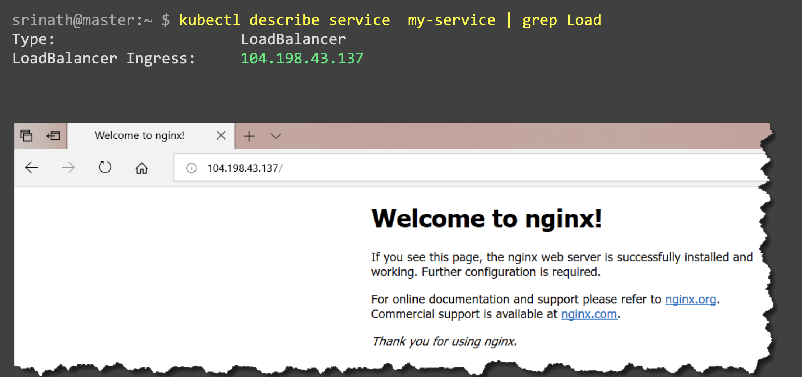

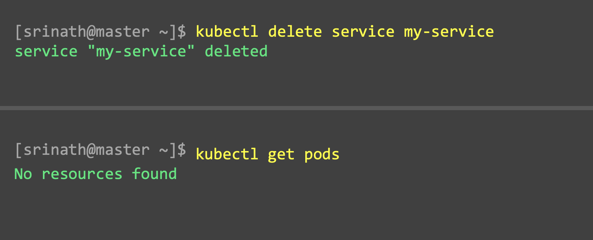

nginx-deploy.yaml

```yaml
apiVersion: apps/v1
kind: Deployment
metadata:
  name: nginx-deployment
  labels:
    app: nginx-app
spec:
  replicas: 1
  selector:
    matchLabels:
      app: nginx-app
  template:
    metadata:
      labels:
        app: nginx-app
    spec:
      containers:
        - name: nginx-container
          image: nginx:1.7.9
          ports:
            - containerPort: 80
```

lb.yaml

```yaml
apiVersion: v1
kind: Service
metadata:
  name: my-service
  labels:
    app: nginx-app
spec:
  selector:
    app: nginx-app
  type: LoadBalancer
  ports:
    - nodePort: 31000
      port: 80
      targetPort: 80
```

```bash
kubectl create ñf nginx-deploy.yaml
kubectl create -f lb.yaml
kubectl get pod -l app=nginx-app
kubectl get deploy -l app=nginx-app 
kubectl get service -l app=nginx-app
kubectl describe service my-service

# Testing Load Balancer Service
# To get inside the pod
kubectl exec -it [pod-name] -- /bin/sh

# Create test HTML page in nginx
cat <<EOF > /usr/share/nginx/html/test.html
<!DOCTYPE html>
<html>
<head>
<title>Testing..</title>
</head>
<body>
<h1 style="color:rgb(90,70,250);">Hello, Kubernetes...!</h1>
<h2>Load Balancer is working successfully. Congratulations, you passed :-) </h2>
</body>
</html>
EOF
exit

# Test using load-balancer-ip
http://load-balancer-ip
http://load-balancer-ip/test.html

# Testing using nodePort
http://nodeip:nodeport
http://nodeip:nodeport/test.html


# Cleanup
kubectl delete ñf nginx-deploy.yaml
kubectl delete -f lb.yaml
kubectl get pod 
kubectl get deploy 
kubectl get service
```

# ClusterIP

> Imagine that, you need to deploy one fully fledged app which consists of frontend application and backend database

How can we restrict access of backend database to only within the Kubernetes cluster?

使用ClusterIP让pod只能在cluster内部被访问
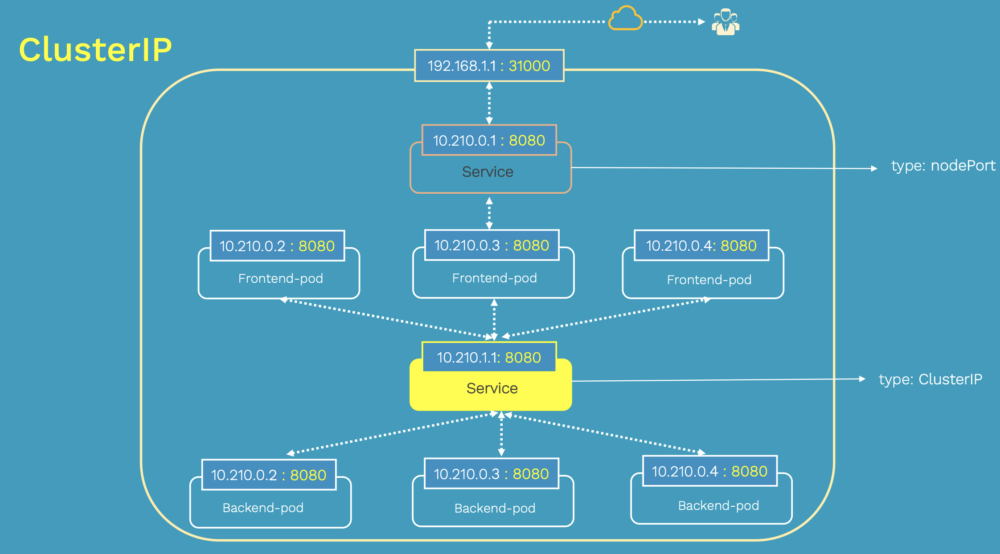

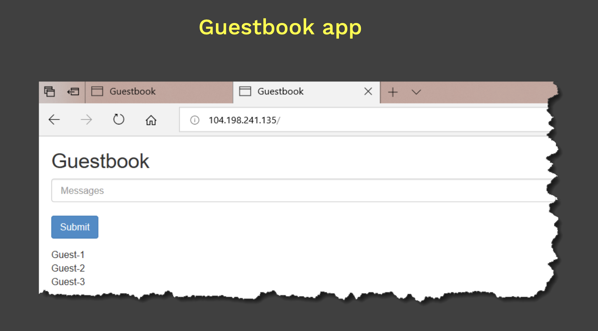

一共创建6个object
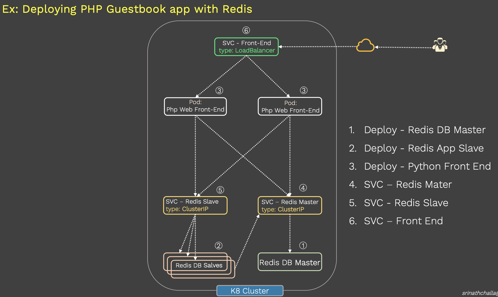

db master
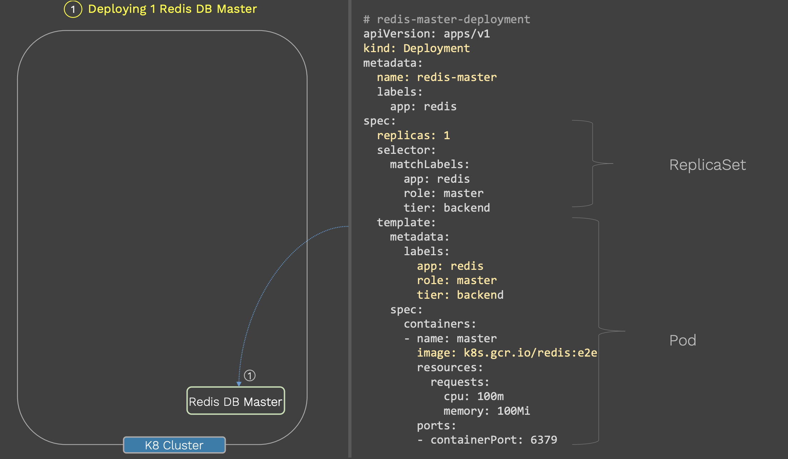

3个 db slave
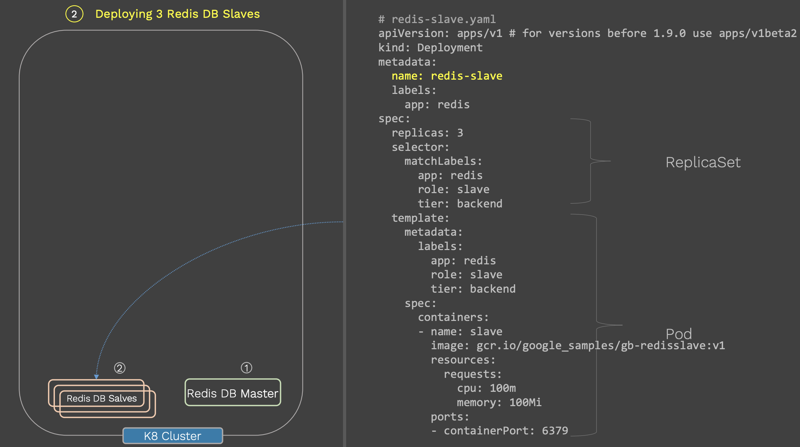

2个frontend
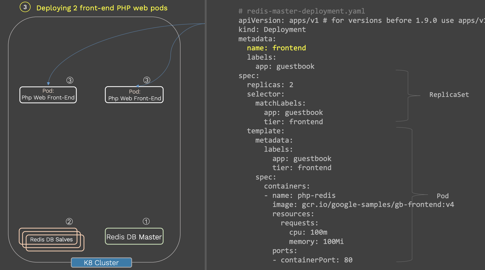

redis db master service


redis db slave service


load balancer service
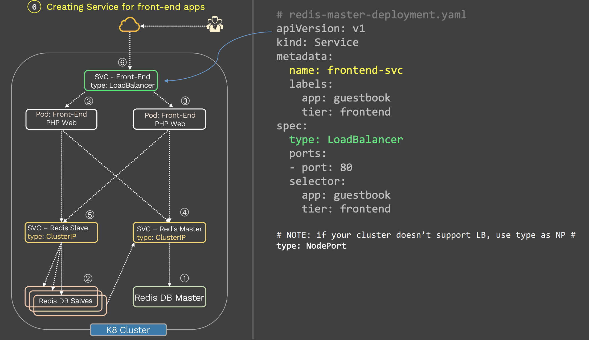

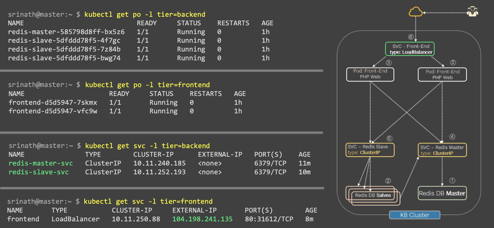
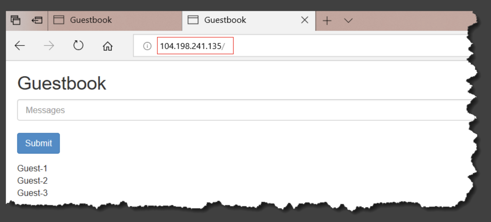


redis-master-deployment.yaml

```yaml
apiVersion: extensions/v1beta1
kind: Deployment
metadata:
  name: redis-master
spec:
  replicas: 1
  template:
    metadata:
      labels:
        app: redis
        role: master
        tier: backend
    spec:
      containers:
        - name: master
          image: k8s.gcr.io/redis:e2e  # or just image: redis
          resources:
            requests:
              cpu: 100m
              memory: 100Mi
          ports:
            - containerPort: 6379
```

redis-master-service.yaml

```yaml
apiVersion: v1
kind: Service
metadata:
  name: redis-master
  labels:
    app: redis
    role: master
    tier: backend
spec:
  type: ClusterIP
  ports:
    - port: 6379
      targetPort: 6379
  selector:
    app: redis
    role: master
    tier: backend
```

```bash
kubectl create -f redis-master-deployment.yaml
kubectl create -f redis-master-service.yaml
kubectl get deploy
kubectl get svc
kubectl get pods
kubectl get logs -f [pod-name]
```

redis-slave-deployment.yaml

```yaml
apiVersion: extensions/v1beta1
kind: Deployment
metadata:
  name: redis-slave
spec:
  replicas: 2
  template:
    metadata:
      labels:
        app: redis
        role: slave
        tier: backend
    spec:
      containers:
        - name: slave
          image: gcr.io/google_samples/gb-redisslave:v1
          resources:
            requests:
              cpu: 100m
              memory: 100Mi
          env:
            - name: GET_HOSTS_FROM
              value: dns
              # If your cluster config does not include a dns service, then to
              # instead access an environment variable to find the master
              # service's host, comment out the 'value: dns' line above, and
              # uncomment the line below:
              # value: env
          ports:
            - containerPort: 6379
```

redis-slave-service.yaml

```yaml
apiVersion: v1
kind: Service
metadata:
  name: redis-slave
  labels:
    app: redis
    role: slave
    tier: backend
spec:
  ports:
    - port: 6379
  selector:
    app: redis
    role: slave
    tier: backend
```

```bash
kubectl create -f redis-slave-deployment.yaml
kubectl create -f redis-slave-service.yaml
kubectl get deploy
kubectl get svc
kubectl get pods
```

frontend-deployment.yaml

```yaml
apiVersion: extensions/v1beta1
kind: Deployment
metadata:
  name: frontend
spec:
  replicas: 2
  template:
    metadata:
      labels:
        app: guestbook
        tier: frontend
    spec:
      containers:
        - name: php-redis
          image: gcr.io/google-samples/gb-frontend:v4
          resources:
            requests:
              cpu: 100m
              memory: 100Mi
          env:
            - name: GET_HOSTS_FROM
              value: dns
              # If your cluster config does not include a dns service, then to
              # instead access environment variables to find service host
              # info, comment out the 'value: dns' line above, and uncomment the
              # line below:
              # value: env
          ports:
            - containerPort: 80
```

frontend-service.yaml

```yaml
apiVersion: v1
kind: Service
metadata:
  name: frontend
  labels:
    app: guestbook
    tier: frontend
spec:
  # if your cluster supports it, uncomment the following to automatically create
  # an external load-balanced IP for the frontend service.
  type: LoadBalancer
  ports:
    - port: 80
  selector:
    app: guestbook
    tier: frontend
```

```bash
kubectl create -f frontend-deployment.yaml
kubectl create -f frontend-service.yaml
kubectl get deploy
kubectl get svc
kubectl get pods
kubectl get service frontend

#[Web-browser] - http://[LB-IP]

# Delete redis-master
kubectl delete -f redis-master-deployment.yaml
kubectl delete -f redis-master-service.yaml

# Delete redis-slave
kubectl delete -f redis-slave-deployment.yaml
kubectl delete -f redis-slave-service.yaml

# Delete frontend-app
kubectl delete -f frontend-deployment.yaml
kubectl delete -f frontend-service.yaml

# Display
kubectl get deploy
kubectl get svc
kubectl get pods
```