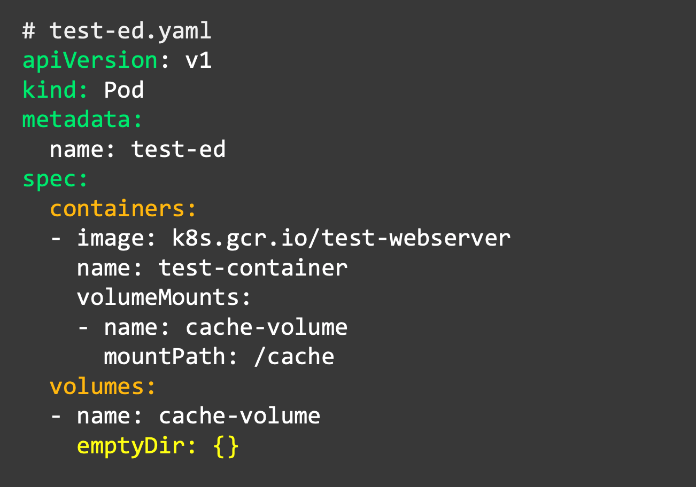
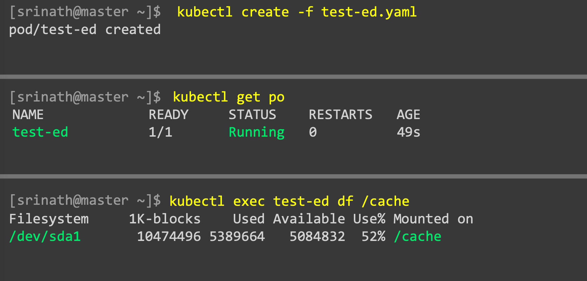
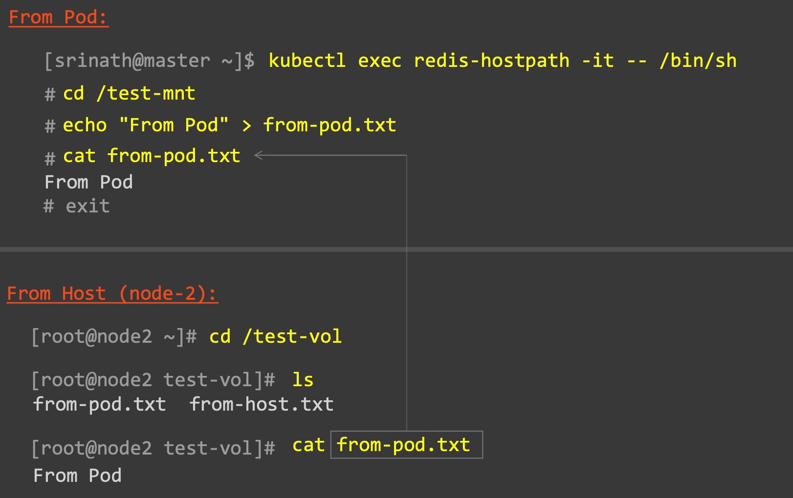

At some point, your apps requires storage where the data is stored and accessed

- How does this storage volumes are handled inside the Kubernetes cluster?
- How can data persist beyond pod life?
- How do these containers share data among them?

Volumes

- Pods are ephemeral and stateless
- Volumes bring persistence to pods
- Adv of Kubernetes volumes vs. Docker volumes
    - Container(s) has access to volume
    - Volumes are associated with Lifecycle of pod
    - Supports many types of volumes

# Volumes types


# emptyDir

- Creates empty directory first created when a Pod is assigned to a Node,
- Stays as long as pod is running
- Once pod is removed from a node, emptyDir is deleted forever

Use cases:

- Temporary space
- share data with containers in a pod





test-ed.yaml

```yaml
apiVersion: v1
kind: Pod
metadata:
  name: test-ed
spec:
  containers:
    - name: test-container
      image: k8s.gcr.io/test-webserver
      volumeMounts:
        - name: cache-volume
          mountPath: /cache
  volumes:
    - name: cache-volume
      emptyDir: { }
```

```bash
kubectl create -f test-ed.yaml
kubectl get po -o wide
# df disk filesystem
# it is used to get a full summary of available and used disk space usage of the file system on Linux system
kubectl exec test-ed df /test-mnt 
kubectl describe pod test-ed

kubectl delete po test-ed
```

# hostPath

- mounts a file or directory from the host node’s filesystem into your Pod
- Remains even after the pod is terminated
- Similar to docker volume
- Use cautiously when required
- Host issues might cause problem to hostPath


双向同步




删除pod之后，数据仍然在


nginx-hostpath.yaml

```yaml
apiVersion: v1
kind: Pod
metadata:
  name: nginx-hostpath
spec:
  containers:
    - name: nginx-container
      image: nginx
      volumeMounts:
        - mountPath: /test-mnt
          name: test-vol
  volumes:
    - name: test-vol
      hostPath:
        path: /test-vol
```

```bash
kubectl create -f nginx-hostpath.yaml
kubectl get po
kubectl exec nginx-hostpath df /test-mnt

#From HOST
cd /test-vol
echo "From Host" > from-host.txt
cat from-host.txt
#From POD
kubectl exec nginx-hostpath cat /test-mnt/from-host.txt


#From POD
kubectl exec nginx-hostpath -it -- /bin/sh
cd /test-mnt
echo "From Pod" > from-pod.txt
cat from-pod.txt
#From Host
cd /test-vol
ls
cat from-pod.txt

kubectl delete po nginx-hostpath
kubectl get po
ls /test-vol
```

# gcePersistentDisk

- Volume mounts a Google Compute Engine (GCE) Persistent Disk into Pod
- Volume data is persisted pods termination
- Read-Write only on one node and Read-Write on many nodes

Restrictions:

- You must create a PD using gcloud or the GCE API or UI before you can use it
- the nodes on which Pods are running must be GCE VMs
- those VMs need to be in the same GCE project and zone as the PD