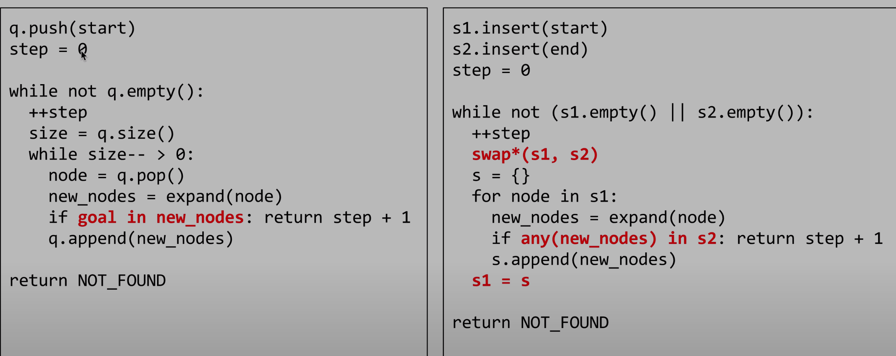

## Problem

Given two words (beginWord and endWord), and a dictionary's word list, find the length of shortest transformation sequence from beginWord to endWord, such that:

Only one letter can be changed at a time.
Each transformed word must exist in the word list. Note that beginWord is not a transformed word.
Note:

Return 0 if there is no such transformation sequence.
All words have the same length.
All words contain only lowercase alphabetic characters.
You may assume no duplicates in the word list.
You may assume beginWord and endWord are non-empty and are not the same.
Example 1:

```
Input:
beginWord = "hit",
endWord = "cog",
wordList = ["hot","dot","dog","lot","log","cog"]

Output: 5

Explanation: As one shortest transformation is "hit" -> "hot" -> "dot" -> "dog" -> "cog",
return its length 5.
```

Example 2:

```
Input:
beginWord = "hit"
endWord = "cog"
wordList = ["hot","dot","dog","lot","log"]

Output: 0

Explanation: The endWord "cog" is not in wordList, therefore no possible transformation.
```

## Code



```java
class Solution {
    public int ladderLength(String beginWord, String endWord, List<String> wordList) {
        Set<String> set = new HashSet<>(wordList);

        Queue<String> queue = new LinkedList<>();
        queue.offer(beginWord);

        int level = 1;
        while(!queue.isEmpty()){
            int size = queue.size();
            for(int i = 0; i < size; i++){
                String curr = queue.poll();
                for(int j = 0; j < curr.length(); j++){
                    char[] arr = curr.toCharArray();
                    for(char x = 'a'; x <= 'z'; x++){
                        arr[j] = x;
                        String temp = new String(arr);
                        // find one work in dict
                        if(set.contains(temp)){
                            if(temp.equals(endWord)) return level + 1;
                            queue.offer(temp);
                            set.remove(temp);
                        }
                    }
                }
            }

            level++;
        }

        return 0;
    }
}
```

- time: O(N \* (26 ^ L)), L = len(word), N = len(wordList)
- space: O(N)

bidirectional BFS

```java
class Solution {
    public int ladderLength(String beginWord, String endWord, List<String> wordList) {
        Set<String> dict = new HashSet<>();
        for (String word : wordList) dict.add(word);

        if (!dict.contains(endWord)) return 0;

        Set<String> q1 = new HashSet<>();
        Set<String> q2 = new HashSet<>();
        q1.add(beginWord);
        q2.add(endWord);

        int l = beginWord.length();
        int steps = 0;
        // 每次从左边扩展一步或者从右边扩展一步
        while (!q1.isEmpty() && !q2.isEmpty()) {
            steps++;

            // 交替更换两个queue
            if (q1.size() > q2.size()) {
                Set<String> tmp = q1;
                q1 = q2;
                q2 = tmp;
            }

            Set<String> q = new HashSet<>();

            for (String w : q1) {
                char[] chs = w.toCharArray();
                for (int i = 0; i < l; ++i) {
                    char ch = chs[i];
                    for (char c = 'a'; c <= 'z'; ++c) {
                        chs[i] = c;
                        String t = new String(chs);
                        // 在另外一个queue中碰到了, 说明找到了路径
                        if (q2.contains(t)) return steps + 1;
                        if (!dict.contains(t)) continue;
                        dict.remove(t);
                        q.add(t);
                    }
                    chs[i] = ch;
                }
            }

            q1 = q;
        }
        return 0;
    }
}
```

- time: O(N \* (26 ^ (L/2)))
- space: O(N)

The complexity of creating a trie is O(W\*L), where W is the number of words, and L is an average length of the word: you need to perform L lookups on the average for each of the W words in the set.

follow up

print one path
