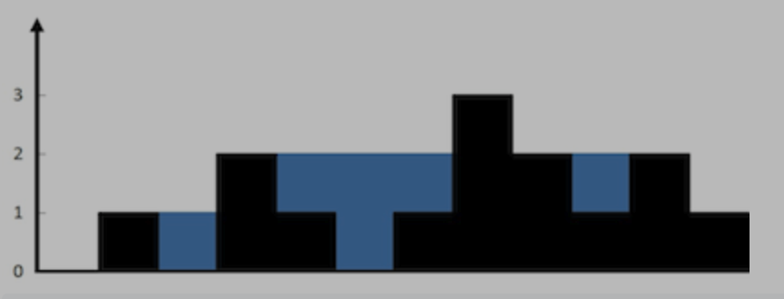

## Problem

Given n non-negative integers representing an elevation map where the width of each bar is 1, compute how much water it can trap after raining.

Example 1:



```
Input: height = [0,1,0,2,1,0,1,3,2,1,2,1]
Output: 6
Explanation: The above elevation map (black section) is represented by array [0,1,0,2,1,0,1,3,2,1,2,1]. In this case, 6 units of rain water (blue section) are being trapped.
```

Example 2:

```
Input: height = [4,2,0,3,2,5]
Output: 9
```

## Code

> 每一个点的积水量: 找左右两边的最高点, 取较小的一个, 在减去这个点的高度

```
r[i] = min(max(h[0~i]), max(h[i~n-1])) - h[i]
```

```java
class Solution {
    public int trap(int[] height) {
        int len = height.length;

        int[] leftMax = new int[len];
        int[] rightMax = new int[len];

        for(int i = 0; i < len; i++) {
            if(i == 0) {
                leftMax[i] = height[i];
            } else {
                leftMax[i] = Math.max(height[i], leftMax[i - 1]);
            }
        }

        for(int i = len - 1; i >= 0; i--) {
            if(i == len - 1) {
                rightMax[i] = height[i];
            } else {
                rightMax[i] = Math.max(height[i], rightMax[i + 1]);
            }
        }

        int res = 0;
        for(int i = 0; i < len; i++) {
            int max = Math.min(leftMax[i], rightMax[i]);
            res += max - height[i];
        }

        return res;
    }
}
```

> leftMax 和 rightMax 都是单调的

```java
class Solution {
    public int trap(int[] height) {
        int left = 0;
        int right = height.length - 1;
        int res = 0;

        int leftMax = 0;
        int rightMax = 0;

        while(left < right){
            if(height[left] < height[right]){
                leftMax = Math.max(leftMax, height[left]);
                res += leftMax - height[left];
                left++;
            } else {
                rightMax = Math.max(rightMax, height[right]);
                res += rightMax - height[right];
                right--;
            }
        }
        return res;
    }
}
```
